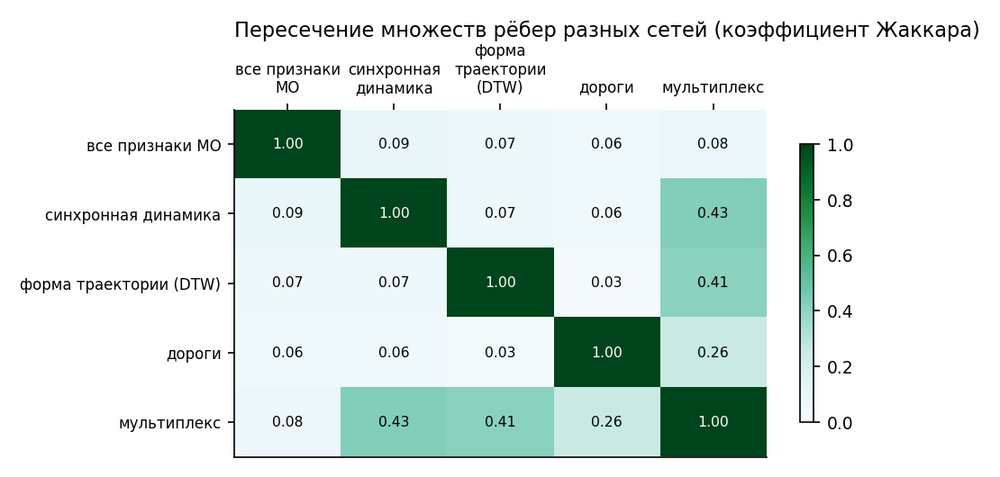
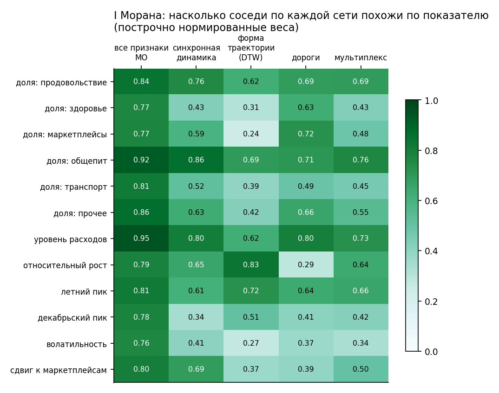
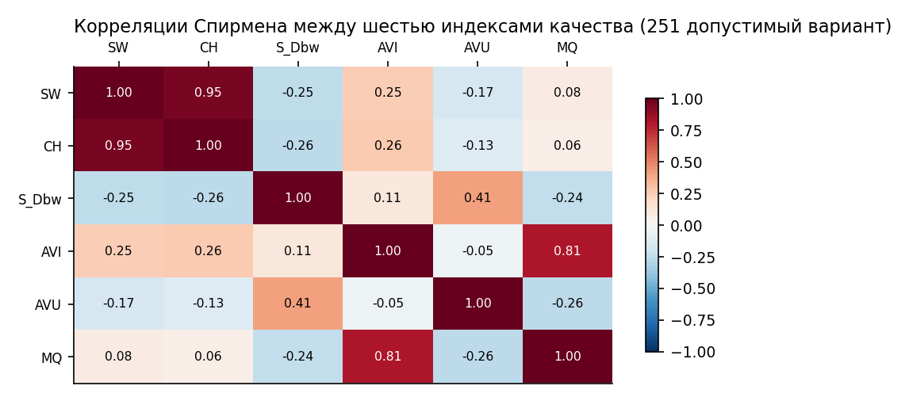
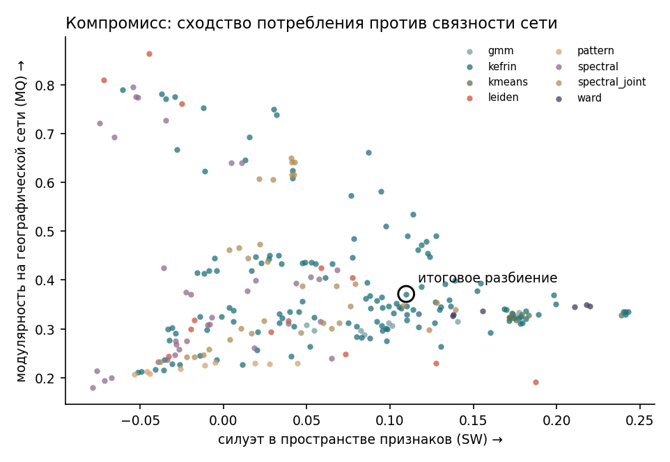
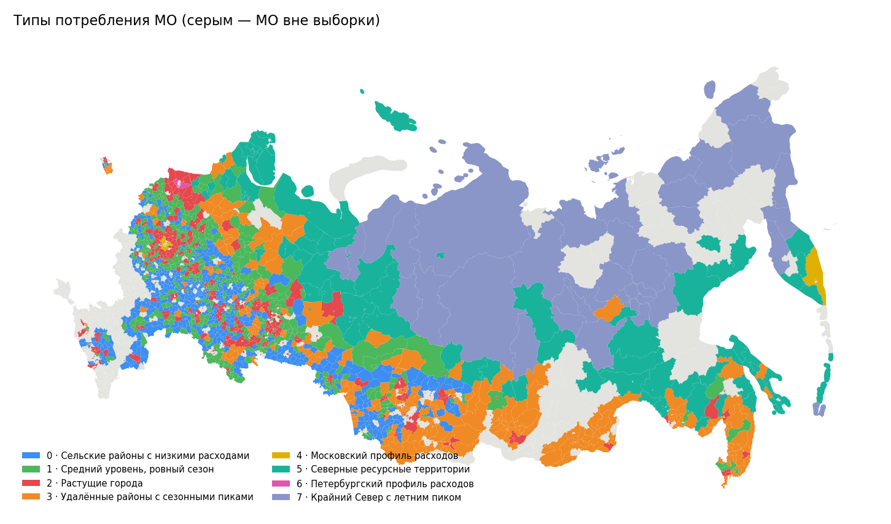
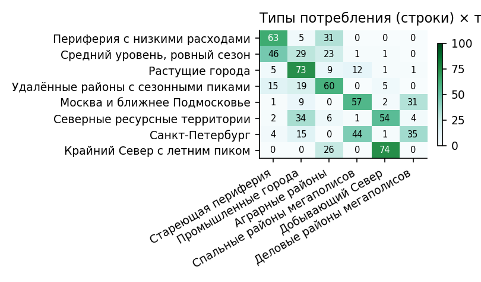
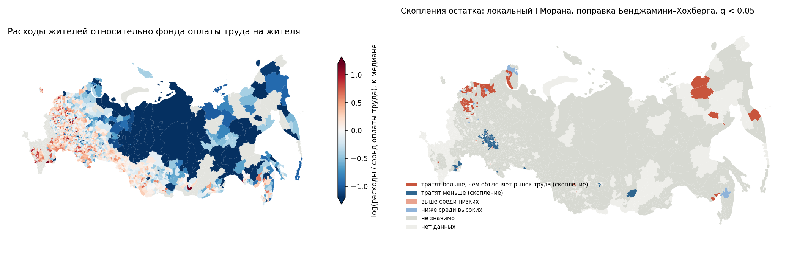
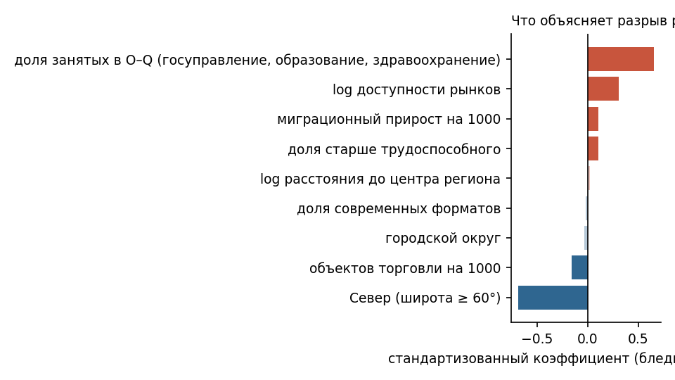

# Потребление против рынка труда: типы локальных экономик муниципалитетов

Методологический отчёт. Конкурс СберИндекса, направление «Кластеризация».

> Версия от 8 октября 2026 г. Краткое резюме на 3–5 страниц — `reports/summary.md`; этот отчёт —
> полное описание. Все числа воспроизводятся командой `python run_all.py` (раздел 11). Таблица
> «утверждение → файл результата → скрипт» — в разделе 12.

## Кратко

- **Вопрос.** Какие типы локального потребления есть среди российских муниципалитетов, если
  учитывать не только структуру и уровень безналичных расходов жителей, но и связи между МО
  (дороги, синхронную динамику, похожие траектории)? Где эти типы расходятся с рынком труда и почему?
- **Данные.** Архив конкурса СберИндекса (расходы за 24 месяца 2023–2024 гг., расстояния,
  индекс доступности рынков), справочник и границы МО СберИндекса, муниципальная статистика
  Росстата (зарплата, занятость, население, миграция, торговля).
- **Сеть.** Четыре семейства рёбер и их мультиплекс сравнены по пересечению рёбер, I Морана,
  превышению взвешенной модулярности над нуль-моделью с точным сохранением степеней. Гипотеза
  «столица опережает периферию» проверена: свидетельств систематического опережения не обнаружено.
- **Методы.** 280 вариантов: k-means, GMM, Уорд, кластеризация паттернов (Мячин), Leiden,
  спектральная, KEFRiN (Shalileh & Mirkin, 2022; реализация по статье) с разными расстояниями и
  весом сети.
- **Выбор и его проверка.** Шесть ICVI, Борда и Коупленд (одинаковый победитель), устойчивость на
  подвыборках. Итог по заданному правилу — KEFRiN на мультиплексе, 8 типов. Дополнительные
  проверки: без дублирующих индексов выбор тот же; без индекса AVU — 17-е место; на внешней сети
  (железные дороги) — 4-е из 251. Финалист с K = 6 устойчивее (ARI на подвыборках 0,81 против
  0,67); восемь типов в основном детализируют шесть (строгой иерархии нет): самый неустойчивый тип —
  «удалённые районы с сезонными пиками» (Жаккар 0,48), он помечен.
- **Типы.** Самые надёжные контрасты — уровень расходов и закон Энгеля, столицы, города с
  растущими расходами, Север. Границы между сельскими типами зависят от геометрии признаков и
  правил оценки. На независимых данных Росстата с типами связано 64% межмуниципальной дисперсии
  логарифма зарплаты (η²); столько же даёт k-means по тем же признакам без сети (65%), разбиение
  только по дорогам — 40%. Крупные контрасты во многом воспроизводятся по одним признакам; сеть
  меняет границы и повышает пространственную концентрацию типов (5.7).
- **Динамика.** Ретроспективное квартальное присвоение типов: 68% МО сохраняют тип все 8
  кварталов (58% без сетевого члена, 72% при двойном весе сети). В скользящих 12-месячных окнах,
  где признаки и связи пересчитываются, метку не меняют 37–46% МО в зависимости от состава признаков
  и seed; ядро (Москва, растущие города) устойчиво, границы сельских и северных типов подвижны,
  преимущество сети по устойчивости во времени не подтверждается (7.1).
- **Потребление против рынка труда.** Типология рынка труда (6 типов) связана с типологией
  потребления, но не совпадает (V Крамера 0,46). Отношение безналичных расходов жителя к фонду
  оплаты труда на жителя — от 3,14 в сельских районах с низкими расходами до 1,0 на Крайнем Севере.
  Различия связаны с долей занятых в госуправлении, образовании и здравоохранении (прокси бюджетной
  занятости), доступностью рынков, Севером и торговой инфраструктурой (R² = 0,66). Разложение
  отношения на числитель и знаменатель показывает, что эти связи идут в основном через учтённый фонд
  оплаты, а не через расходы (8.4). Данные Росстата
  подготовлены с проверками баланса и согласованности (8.1); после исправления ошибок первой версии
  подготовки основные содержательные выводы сохранились (8.7). Три из четырёх разобранных случаев согласуются с объяснением
  разницей учёта: занятость — по месту работы, расходы — по месту жительства (вахтовые
  месторождения, Иннополис, пригород); четвёртый (Арктика) — с ценами и доходами вне фонда оплаты.

---

## Связь с литературой

Работа опирается на шесть областей литературы. Для каждой ниже сказано, что из неё взято, что
сделано иначе и где проходит граница применимости ссылки. Числа самой работы (доли, коэффициенты,
число переходов) получены в проекте и подтверждаются его таблицами и кодом (раздел 12), а не
статьями. Ссылки обосновывают метод, определение или возможный механизм.

**1. Потребление и доход.** Закон Энгеля — доля расходов на питание падает с ростом дохода — одна из
самых устойчивых эмпирических закономерностей экономики потребления (история и эмпирика кривых
Энгеля — Chai & Moneta, 2010; теория спроса и бюджетных долей — Deaton & Muellbauer, 1980). У нас
муниципальная корреляция уровня расходов с долей продовольствия (−0,77) согласуется с законом
Энгеля. Индивидуальные кривые здесь не оцениваются, а связи по МО нельзя переносить на поведение
жителей (Robinson, 1950).

Текущие расходы и текущий доход не тождественны:
- потребление по-разному реагирует на постоянные и временные изменения дохода (Jappelli &
  Pistaferri, 2010);
- сбережения служат буфером при ограничениях заимствования (Deaton, 1991);
- в национальных счетах располагаемый доход делится на потребление и сбережение, а оплата труда —
  лишь часть первичных доходов домохозяйств (SNA 2008, гл. 2).

Поэтому отношение банковских расходов жителей к фонду оплаты труда организаций — не норма
потребления и не мера благосостояния. Это индикатор расхождения двух разных измерений одной
территории. Вклад трансфертов, кредита, сбережений и цен в нём по имеющимся данным не разделяется.

**2. Пространство и рынки труда.**
- *Место работы и место жительства.* Рынки труда локальны, но перекрываются: привлекательность
  вакансии быстро падает с расстоянием, при этом соседние районы связаны общим поиском работы
  (Manning & Petrongolo, 2017). Это основание рассматривать несовпадение места работы и места
  жительства как возможный механизм расхождений (8.5). Фактические потоки маятниковой миграции в
  данных не наблюдаются.
- *Доступность рынков.* Это стандартная мера экономической географии (Donaldson & Hornbeck, 2016;
  обзор количественной пространственной экономики — Redding & Rossi-Hansberg, 2017). Индекс
  доступности из архива конкурса используется как контроль и внешний показатель; причинный эффект
  не оценивается.
- *Цены.* Пространственные различия цен меняют сравнение номинальных доходов и расходов (Moretti,
  2013), поэтому северные номинальные расходы без местного дефлятора нельзя читать как уровень
  жизни.

**3. Признаки: композиционные данные.** Доли расходов в сумме дают единицу, поэтому их анализируют
через логарифмы отношений (Aitchison, 1982; 1986). ILR — изометрическое представление долей
(Egozcue et al., 2003). Мы используем CLR с раздельной стандартизацией координат и равными весами
блоков. Это собственное решение о весах, которое из литературы не следует; поэтому отдельно
проверен вариант ILR (5.6).

**4. Кластеризация атрибутированных сетей.**
- *KEFRiN.* Обзор методов кластер-анализа как инструмента поддержки решений — Миркин (2011). KEFRiN —
  расширение k-means, совмещающее признаки узлов и модулярно преобразованные связи (Shalileh &
  Mirkin, 2022). Мы реализовали его по статье, проверили на синтетике с известным ответом и явно
  описали собственную адаптацию — выравнивание вклада блоков (4.1).
- *Многослойная сеть.* Это язык для разных отношений между одними и теми же узлами (Kivelä et al.,
  2014). Наши слои — разные понятия близости, а не наблюдаемые потоки торговли, труда или влияния.
  Конкретные k, ядра расстояний и нормировка слоёв — наши решения, проверенные исключением слоёв и
  сменой нормировки.
- *Методы для сравнения.* Leiden (Traag et al., 2019), спектральная кластеризация, модулярность
  (Newman, 2006) и порядково-инвариантная кластеризация паттернов (Мячин, 2019).

**5. Валидация, устойчивость, интерпретация.**
- *Индексы качества.* В пространстве признаков: силуэт (Rousseeuw, 1987), индекс Калински–Харабаша
  (1974), S_Dbw (Halkidi & Vazirgiannis, 2001). Сетевые: AVI и AVU (Biswas & Biswas, 2017),
  модулярность (Newman, 2006). Индексы признакового и сетевого пространств измеряют разные свойства,
  и единого победителя по ним нет (Shalileh et al., 2025). Отсюда агрегирование рангов и проверка
  чувствительности к составу индексов (5.5).
- *Цель кластеризации.* Качество зависит от цели применения (von Luxburg et al., 2012): итоговое
  разбиение оптимально по объявленному правилу, а не по универсальной шкале «правильности»
  экономических типов. Восемь типов — рабочая исследовательская типология.
- *Устойчивость.* Устойчивость отдельных кластеров на подвыборках оценивается коэффициентом Жаккара
  (Hennig, 2007), согласие разбиений — скорректированным индексом Рэнда (Hubert & Arabie, 1985). ARI
  0,67 — не доля правильно классифицированных МО. Устойчивость может отражать и жёсткость метода.
- *Описания типов.* Анализ формальных понятий (Ganter & Wille, 1999) и оценки устойчивости понятий
  (Kuznetsov, 2007; Buzmakov et al., 2014). Правила описывают найденные группы, но не объясняют их
  независимо.
- *Динамика.* Эволюционная кластеризация балансирует соответствие текущим данным и плавность
  изменений (Chakrabarti et al., 2006). Мы этот алгоритм не реализуем, а сравниваем ретроспективное
  присвоение с пересчётом связей в скользящих окнах (7, 7.1). При временной и пространственной
  зависимости данных случайные подвыборки измеряют устойчивость разбиения, но не перенос на новые
  территории или годы (Roberts et al., 2017).

**6. Пространственная статистика и вывод.**
- *Скопления.* Локальные индикаторы пространственной ассоциации — Anselin (1995). Множественные
  проверки — контроль FDR (Benjamini & Hochberg, 1995), при зависимости тестов — более строгая
  поправка (Benjamini & Yekutieli, 2001). Перестановочные p-значения — Phipson & Smyth (2010).
  Скопление остатка модели не указывает механизм.
- *Регрессия отношения.* Отношения несут риск ложных корреляций из-за общего знаменателя (Kronmal,
  1993), поэтому модель разрыва разложена на числитель и знаменатель (8.4).
- *Ошибки.* Ошибки кластеризованы по регионам (Cameron & Miller, 2015). Зависимость через границы
  регионов они не учитывают; пространственные стандартные ошибки (Conley, 1999) — направление для
  дальнейшей проверки, в работе они не рассчитаны.

**Что добавляет работа к этой литературе:**
- Две типологии одних и тех же МО построены независимо: по безналичному потреблению жителей и по
  статистике труда организаций. Их расхождение изучается как отдельный объект — где оно, насколько
  надёжно мы его видим и с чем оно связано.
- KEFRiN применён к многослойной сети муниципалитетов. Выбор среди 280 вариантов и шести индексов
  сделан по правилу, объявленному до просмотра типов. Вклад сети прямо сопоставлен с k-means по тем же
  признакам.
- Подготовка муниципальной статистики проверена на уровне строк источника: баланс разделов ОКВЭД2,
  иерархия строк формы 1-ТОРГ (МО), среднегодовая численность, структурные нули. Все исключения
  выведены в таблицы.
- У каждого МО измерена надёжность типа, а временная устойчивость проверена при пересчёте связей.

---

## 1. Данные

### 1.1. Источники

| Источник | Содержание | Лицензия |
|---|---|---|
| Архив конкурса `hackathonlicence.zip` | `consumption`: средние безналичные расходы жителя МО за месяц (модельная оценка СберИндекса), руб., 5 категорий + «Все категории», январь 2023 – декабрь 2024; `connection`: расстояния между центрами МО по автодорогам и железным дорогам; `market_access`: индекс доступности рынков 2024 г. (0–1000) | CC BY-SA 4.0 |
| Справочник МО СберИндекса | названия, регионы, тип и статус МО, ОКТМО по версиям 2018–2024, полигоны | условия СберИндекса |
| «Муниципальная статистика России с 2005 года» («Если быть точным», по БД ПМО Росстата) | зарплата, численность работников и фонд оплаты труда по ОКВЭД2, население, возрастная структура, миграция, объекты торговли | CC BY 4.0 |

Исходные данные в репозиторий не кладутся (результаты расчётов в `data/processed` — кладутся, кроме
`landing_data.json`, который собирается при сборке страницы). Архив конкурса скачивает `src/download.py` и сверяет
контрольные суммы (другая версия данных — ошибка, если не указан `--allow-new-data`); справочник и
архивы муниципальной статистики скачиваются вручную, после чего `src/download.py --dict` и
`src/extract_bdmo.py` готовят их к работе (раздел 11).

### 1.2. Выборка и пропуски

Из 2 190 МО полный ряд (24 месяца по всем категориям) есть у **2 016**. Это базовая выборка.
Пропуски не случайны: СберИндекс публикует оценку только там, где она проходит порог качества.
Выпавшие 174 МО отличаются: медиана расходов 22 821 руб. против 24 427 руб. в выборке, доля
маркетплейсов 12,2% против 14,6%. Выводы относятся к МО с достаточным безналичным оборотом;
выпавшие МО на картах показаны серым.

Покрытие дополнительных данных среди 2 016 МО: индекс доступности рынков — 2 004, расстояния по
автодорогам — 2 006 (у 10 МО нет дорожной связи), по железным дорогам — 1 262. Железнодорожные
пары в архиве записаны в обе стороны с одинаковым расстоянием (вопреки описанию) — дубли
объединяются. У 148 пар разных МО расстояние по дорогам равно 0 (общий центр) — заменено на 1 км.

Все 2 190 МО нашлись в справочнике; у трёх (Павловский Посад, Электрогорск, Сасово) в 2024 г.
прошло объединение с соседями, для них взята последняя существовавшая версия.

## 2. Признаки узлов

Три блока, у каждого своя экономическая логика.

1. **Структура расходов.** Доли пяти категорий и «прочего» (1 − сумма пяти), среднее за 24
   месяца. Доли — композиционные данные, поэтому они переведены в центрированные лог-отношения
   (CLR; Aitchison, 1982, 1986). Затем каждая CLR-координата стандартизована отдельно: это авторское
   взвешивание (редкие категории получают тот же вес, что и продовольствие), а не изометрическое
   преобразование; альтернатива — ILR (Egozcue и др., 2003) — проверена в разделе 5.6.
2. **Относительный уровень.** Лог-разность расходов МО и медианы по всем МО в том же месяце,
   среднее за период. Разность убирает общий для страны рост и календарные пики, но сохраняет
   различия в уровне безналичных расходов.
3. **Динамика.** Отличия траектории МО от типичной: относительный рост 2024/2023, летний и
   декабрьский пики сверх общих, волатильность после удаления тренда, сдвиг к маркетплейсам.

Каждый блок после стандартизации поделён на √(число признаков), так что блоки весят одинаково.

**Относительные траектории** (лог-расходы минус медиана по МО в том же месяце, по каждой
категории) нужны для рёбер. Это удаление общего национального компонента, а не доказанное
удаление региональных трендов и региональной сезонности. Медиана попарной корреляции таких рядов
0,004, 95-й процентиль — 0,71.

По МО уровень расходов почти зеркален доле продовольствия (корреляция −0,77) и тесно связан с
долей общепита (+0,84). Муниципальная корреляция согласуется с законом Энгеля (Chai & Moneta, 2010;
Deaton & Muellbauer, 1980); индивидуальные зависимости дохода и потребления здесь не оцениваются, а
связи по МО нельзя переносить на поведение жителей (Robinson, 1950).

## 3. Сеть: четыре понятия близости

### 3.1. Построение

| Семейство | Близость | Построение |
|---|---|---|
| `structure` | похожий профиль МО по всем признакам узла (структура, уровень, динамика) | косинус векторов признаков |
| `comovement` | синхронная динамика | корреляция относительных траекторий всех категорий (у каждого ряда вычтено среднее МО) |
| `leadlag` | похожая форма траектории с допуском на сдвиг | DTW по относительной траектории общих расходов, окно Сакое–Чибы 3 месяца, ядро exp(−d/медиана) |
| `geography` | физическая близость | расстояние по автодорогам, ядро exp(−d/150 км) |
| `multiplex` | реляционные слои вместе | сумма `geography`, `comovement`, `leadlag`, каждый слой нормирован на средний вес ребра (агрегированное представление многослойной сети, Kivelä и др., 2014) |

Плотные матрицы близости разрежены до k ближайших соседей (k = 10, для дорог k = 8) и
симметризованы. Граф `structure` в мультиплекс не входит: он строится из тех же признаков, что и
блок признаков в KEFRiN. При нормировке на средний вес ребра доли слоёв в общей массе весов
неравны (дороги 23%, синхронная динамика 39%, DTW 37%); вариант с равными массами проверен в 5.6.

Слои — разные виды близости, а не наблюдаемые потоки торговли, труда или причинного влияния. Язык
многослойных сетей (Kivelä и др., 2014) описывает такую структуру, но конкретные k, ядра расстояний
и нормировка слоёв из него не следуют: это наши решения, проверенные исключением слоёв и сменой
нормировки (5.6).

| Граф | Рёбер | Средняя степень | Компонент | Изолированных |
|---|---:|---:|---:|---:|
| structure | 14 363 | 14,2 | 1 | 0 |
| comovement | 16 730 | 16,6 | 1 | 0 |
| leadlag | 15 948 | 15,8 | 1 | 0 |
| geography | 9 986 | 9,9 | 13 | 10 |
| multiplex | 38 747 | 38,4 | 1 | 0 |

У дорожного графа 13 компонент: главная (1 986 МО), Сахалин с двумя островными районами
Хабаровского края (18 МО), одна пара МО Красноярского края и 10 МО без дорожной связи.

### 3.2. Сравнение

**Разные понятия близости дают почти разные сети.** Коэффициент Жаккара между множествами рёбер
любых двух семейств не выше 0,09. Это доказывает различие наборов связей, но не полезность
каждого: полезность проверена исключением слоёв (5.6).



**I Морана** (построчно нормированные веса):

- по дорогам похожи структура и уровень расходов (I = 0,49–0,80), слабее — динамика (рост 0,29,
  волатильность 0,37; исключение — летний пик, 0,64: сезонность географична);
- по синхронной динамике соседи похожи и по уровню и структуре (уровень 0,80, доля общепита
  0,86), и по росту (0,65);
- по DTW сильнее всего похожи рост (0,84) и летний пик (0,72);
- граф `structure` даёт 0,76–0,95, но он собран из тех же признаков, поэтому это верхняя граница.



**Структура сообществ против нуль-модели.** Взвешенная модулярность разбиения Leiden сравнена с
тем же показателем на 20 случайных графах с точно теми же степенями (попарные переключения
рёбер, веса переставлены; силы вершин такая модель не сохраняет):

| Сеть | Модулярность | Нуль-модель (среднее ± ст. откл.) | Превышение | Сообществ |
|---|---:|---:|---:|---:|
| structure | 0,693 | 0,246 ± 0,001 | 0,447 | 10 |
| comovement | 0,701 | 0,235 ± 0,003 | 0,466 | 10 |
| leadlag | 0,677 | 0,236 ± 0,003 | 0,442 | 8 |
| geography | 0,895 | 0,350 ± 0,002 | 0,545 | 43 |
| multiplex | 0,536 | 0,161 ± 0,001 | 0,374 | 6 |

У дорог самая выраженная структура сообществ, но 43 сообщества — это скорее регионы, чем типы.

**Направленные связи** (`src/descriptives.py`). Для каждой пары «столица региона — другое МО
региона» найден лаг (±3 месяца) с максимальной корреляцией первых разностей относительных
траекторий. По всем 1 532 парам лучший лаг нулевой в 47,5% пар, столица «опережает» в 25,1%,
«отстаёт» в 27,5%; в среднем по 60 регионам (каждый регион с равным весом) — 49%, 25% и 26%.
Критерий Уилкоксона по регионам p = 0,79; у случайной «псевдостолицы» — 28% и 27% (средние
региональных долей, p = 0,62). При выбранной процедуре свидетельств систематического опережения не обнаружено; это
не доказывает отсутствия эффекта (Wasserstein & Lazar, 2016), но направленные рёбра без такого
свидетельства вводить не стоит.

**Сеть синхронной динамики по годам нестабильна.** Граф, построенный отдельно по 2023 и 2024 гг.,
почти не повторяется (Жаккар рёбер 0,065). Это ограничение: оно не разделяет изменение экономики,
короткий ряд и шум. Поэтому слой строится по 24 месяцам, а сеть в работе статична.

**Сеть для оценки.** Сетевые индексы качества считаются на дорогах (сеть дана организаторами и не
построена из расходов). Дороги — один из слоёв мультиплекса, поэтому дополнительно использованы
железные дороги, не входящие ни в один слой (5.5).

## 4. Методы

| Метод | Что использует | Сильные стороны | Ограничения |
|---|---|---|---|
| k-means | признаки | быстрый, понятные центры | шарообразные кластеры одного масштаба |
| GMM (полная ковариация) | признаки | эллипсоидные кластеры разной формы | неустойчив при многих параметрах; CLR-пространство вырождено (регуляризация ковариации) |
| Уорд | признаки | иерархия, детерминирован | чувствителен к составу выборки и выбросам |
| Паттерны (Мячин) | порядок показателей | не зависит от порядка показателей и от общего монотонного преобразования | различает только порядок; число кластеров не задаётся |
| Leiden (гибрид) | сеть | связные сообщества на главной компоненте; число сообществ определяется данными | игнорирует признаки; МО вне главной компоненты (30 на дорогах) присоединяются по признакам — это модификация; чистый Leiden делает из каждой малой компоненты отдельное сообщество и не проходит фильтр допустимости |
| Спектральная (сеть) | сеть | невыпуклые структуры | так же работает на главной компоненте |
| Спектральная (признаки + сеть) | граф признаков + сеть | простое объединение источников | вес слоёв задаётся вручную |
| KEFRiN | признаки + сеть | единый критерий метода наименьших квадратов | вес сети ξ критичен на разреженных графах (см. ниже) |

### 4.1. KEFRiN

KEFRiN (Shalileh, Mirkin, *Entropy*, 2022, 24(5):626) моделирует одновременно признаки МО `y_i` и
строку матрицы связей `p_i` через центры кластеров в обоих пространствах:

F = ρ · Σ_i d(y_i, c_k(i)) + ξ · Σ_i d(p_i, λ_k(i)).

Реализация (`src/methods.py`) — по статье, без чужого кода: признаки — z-оценки; связи —
модулярное преобразование p_ij − p_i+·p_+j / p_++; инициализация — вариант K-Means++ с MaxMin по
сумме расстояний до уже выбранных семян, как у авторов; чередование «назначение — пересчёт
центров» до неизменности разбиения; 20 запусков, лучший по критерию; расстояния — евклидово
(квадрат) и косинусное (манхэттенское реализовано, но в сравнение не вошло из-за времени счёта).

**Что взято из статьи, а что — наша адаптация.** Авторы берут ρ = ξ = 1 и называют подбор весов
задачей на будущее. Их синтетические сети плотные (вероятности связи 0,7–0,9 внутри сообществ,
0,3–0,6 между), а среди реальных данных есть и разреженные (Cora: 2 708 вершин, 5 276 связей).
Наша адаптация: в евклидовом варианте ξ умножается на отношение полного разброса блоков
Σy² / Σp², так что вклад блоков в критерий выравнивается. Для победителя (мультиплекс) фактический
ξ = 0,054, для дорог — 0,76 (`kefrin_xi.json`); надпись «ξ×1» означает именно это. В основной сетке евклидов вариант
проверяется только при множителе 1, косинусный — при ξ ∈ {1, 4, 16}; сетка выбрана после
разведочного прогона (ξ до 256) на тех же индексах.

Корректность проверена на синтетике с известным ответом (`tests/test_methods.py`): только по сети
метод восстанавливает стохастическую блочную модель (ARI > 0,95); когда признаки отделяют один
тип, а сеть — два других, KEFRiN находит все три (ARI > 0,9).

**Когда сеть влияет на результат** (`src/synthetic.py`). Симметричный генератор (одна общая
константа для матрицы вероятностей), средняя степень 5 / 10 / 20, 10 повторов, у всех вариантов
KEFRiN по 10 инициализаций. Среднее ARI с истинным разбиением (стандартные отклонения — в
`synthetic_benchmark.csv`: у большинства ячеек ≤ 0,05, но в переходной зоне больше — например,
0,13 у «ξ×4, источники дополняют», 0,25 у того же варианта при степени 5):

| Средняя степень | Метод | Признаки информативны | Сеть информативна | Источники дополняют друг друга | Оба слабые |
|---:|---|---:|---:|---:|---:|
| 10 | k-means (признаки) | 0,86 | 0,00 | 0,46 | 0,13 |
| 10 | Leiden (сеть) | 0,00 | 0,98 | 0,46 | 0,05 |
| 10 | KEFRiN исходный (ρ = ξ = 1) | 0,85 | 0,00 | 0,46 | 0,14 |
| 10 | KEFRiN, выравнивание, ξ×1 | 0,86 | 0,00 | 0,46 | 0,14 |
| 10 | KEFRiN, выравнивание, ξ×4 | 0,84 | 0,01 | **0,90** | 0,15 |
| 10 | KEFRiN cos, ξ = 16 | 0,03 | 0,93 | 0,46 | 0,08 |
| 20 | KEFRiN исходный (ρ = ξ = 1) | 0,86 | 0,12 | **0,96** | 0,17 |
| 20 | KEFRiN, выравнивание, ξ×1 | 0,86 | 0,00 | 0,85 | 0,14 |
| 5 | KEFRiN, выравнивание, ξ×4 | 0,74 | 0,01 | 0,36 | 0,12 |

На разреженной сети (степень 10) исходный KEFRiN совпадает с k-means: сетевой член почти не
влияет. Объединение источников начинает работать при большем весе сети (ξ×4 — 0,90) или при более
плотной сети (степень 20 — 0,96 уже при исходных весах); при степени 5 сеть слишком скудна.
Мультиплекс в 3,9 раза плотнее дорожного графа (средняя степень 38 против 10), что согласуется с
его победой; но плотность, веса и содержание рёбер в нём меняются одновременно, поэтому это
гипотеза, а не доказанная причина.

### 4.2. Порядково-инвариантная кластеризация паттернов

Мячин А.Л. // Автоматика и телемеханика. 2019. №1. С. 138–152. Для каждой пары показателей
объекта код e = 1, если x_s < x_j; 0 — если равны; 2 — если больше. МО с совпадающими кодами всех
пар образуют кластер. Показатели — z-оценки долей пяти категорий. Значения непрерывны и равенств
практически нет, поэтому возможны 5! = 120 строгих порядков (при допуске на равенство пространство
слабых порядков было бы больше). Инвариантность — к перестановке показателей и к общему
монотонному преобразованию всех показателей, а не к независимому преобразованию каждого; к
погрешности измерений метод отдельно не проверялся.

В исходном виде метод дал 119 паттернов из 120; 96 включают ≥ 5 МО. Два самых частых (общепит >
транспорт/здоровье > маркетплейсы > продовольствие, 268 МО) — городской полюс; противоположный —
сельский. Для сравнения при фиксированном K добавлено **наше расширение**: K самых частых
паттернов — центры, остальные МО присоединяются к ближайшему по расстоянию Кемени.

### 4.3. Сетка вариантов

K от 4 до 12; Leiden — разрешение 0,02–1,0; сетевые методы — на каждой из четырёх сетей; KEFRiN —
cosine × ξ ∈ {1, 4, 16} и euclidean × ξ×1. Всего 280 вариантов.

## 5. Оценка качества и выбор разбиения

### 5.1. Индексы

| Индекс | Пространство | Определение в работе | Лучше |
|---|---|---|---|
| SW | признаки | евклидов силуэт (Rousseeuw, 1987) | ↑ |
| CH | признаки | Калински–Харабаш (1974) | ↑ |
| S_Dbw | признаки | Halkidi & Vazirgiannis (2001): Scat + Dens_bw; плотность у центров и в середине считается на объединении двух кластеров, радиус — stdev; при нулевом знаменателе слагаемое равно 0 | ↓ |
| AVI | сеть | средняя по кластерам доля веса рёбер внутри кластера: S_kk / Σ_j S_kj (Biswas & Biswas, 2017; формулы 18–19 у Shalileh и др., 2025) | ↑ |
| AVU | сеть | (1/K) Σ_i Σ_{j≠i} S_ij / (out_i + in_j − S_ij) (там же, формулы 20–21) | ↓ |
| MQ | сеть | **MQ := Q Ньюмана** (взвешенная модулярность; Newman, 2006). В литературе есть и Modularization Quality Манкоридиса; в положении конкурса MQ не определён | ↑ |

S_ij — сумма весов рёбер между кластерами i и j в симметричной матрице, поэтому каждое ребро
внутри кластера входит в S_kk дважды; изолированные вершины в S не вносят ничего. Формулы
проверены контрольными примерами, посчитанными вручную (`tests/test_controls.py`: S_Dbw на
одномерном примере, AVI/AVU/MQ на трёх кластерах с неравными весами), модулярность — против
networkx. Сетевые индексы считаются на дорожной сети для всех вариантов.

### 5.2. Индексы тянут в разные стороны

Корреляции Спирмена по 251 допустимому варианту: SW и CH почти дублируют друг друга (0,95), AVI и
MQ — тоже (0,81); между «признаковыми» и «сетевыми» индексами связь слабая (|ρ| = 0,06–0,26),
кроме S_Dbw и AVU (0,41; у обоих лучше меньшее значение); W
Кендалла = 0,39. SW ≈ 0,11 у победителя и ≤ 0,24 у всех допустимых вариантов: потребительские профили образуют
континуум, а не резко разделённые группы.





### 5.3. Правило выбора

Правило задекларировано в конфигурации до просмотра типов, но после разведочного подбора сетки ξ
(4.1); история git не доказывает момент его фиксации.

1. **Допустимость:** каждый тип ≥ 1% МО, ни один тип не больше 60%. Допустимы 251 из 280.
2. **Агрегирование рангов.** Борда — сумма рангов; Коупленд — победы минус поражения в попарных
   сравнениях большинством индексов. Оба правила используют одну таблицу оценок, поэтому их
   совпадение — не независимая проверка.
3. **Устойчивость.** Для 12 лучших по Борда — 50 подвыборок по 80% МО (на подграфах той же сети, с
   теми же признаками), ARI (Hubert & Arabie, 1985) с полным разбиением на тех же МО. Порог — средний ARI ≥ 0,6 (авторский,
   не универсальный). Итог — лучший по Борда среди прошедших порог.

Индексы признакового и сетевого пространств измеряют разные свойства разбиения, и единый
победитель по ним не гарантирован (Shalileh и др., 2025); отсюда агрегирование рангов и проверка
чувствительности к составу индексов (5.5). Итог оптимален по объявленному правилу, а не по
универсальной шкале качества экономических типов: качество кластеризации зависит от цели применения
(von Luxburg и др., 2012), и восемь типов — рабочая исследовательская типология.

### 5.4. Результат по правилу

| Вариант | K | Борда | Коупленд | ARI на подвыборках |
|---|---:|---:|---:|---:|
| **KEFRiN, мультиплекс, евкл., ξ×1** | **8** | **1** | **1** | **0,65** |
| KEFRiN, мультиплекс, евкл., ξ×1 | 6 | 2 | 2 | 0,72 |
| KEFRiN, дороги, cos, ξ = 1 | 12 | 3 | 3 | 0,47 |
| KEFRiN, DTW, евкл., ξ×1 | 7 | 4 | 4 | 0,67 |
| KEFRiN, мультиплекс, евкл., ξ×1 | 7 | 5 | 5 | 0,76 |

(В отборе использовались 5 инициализаций на подвыборку; уточнённые значения с 20 инициализациями
— в 5.5.) Лучший вариант каждого семейства по Борда: KEFRiN — 1; k-means — 17 (K = 7); Уорд — 30
(K = 6); спектральная по признакам и сети — 40; Leiden (гибрид) — 57; спектральная по сети — 96;
GMM — 107; паттерны — 221.

Показатели победителя: SW = 0,110, CH = 425, S_Dbw = 0,464, AVI = 0,606, AVU = 0,372, MQ = 0,371
(k-means при K = 8: SW = 0,173, AVI = 0,493, MQ = 0,333). Это компромисс: по AVU вариант первый,
по остальным пяти индексам — с 53-го по 88-е место из 251; первое место по сумме рангов он
получает за отсутствие провалов. Отсюда и зависимость от AVU в 5.5.

ARI с k-means по тем же признакам при K = 7 — 0,81: сеть не переворачивает типологию; главное
отличие — столичный кластер k-means (309 МО) разделён на Москву (164) и Петербург (99), а 40 его
МО отнесены к «растущим городам» и 6 — к северным ресурсным территориям.

### 5.5. Насколько результат зависит от правил: финалисты, устойчивость типов, оптимизация

**Состав индексов и внешняя сеть** (`src/robustness.py`):

| Правило | Победитель | Место выбранного | ARI победителя с выбранным |
|---|---|---:|---:|
| все 6 индексов (основное) | KEFRiN, мультиплекс, K = 8 | 1 | 1,00 |
| без дублей (SW, CH, AVI, MQ с весом 1/2) | то же | 1 | 1,00 |
| без SW / без MQ | то же | 1 | 1,00 |
| без CH | KEFRiN, дороги, cos, K = 12 | 3 | 0,28 |
| без S_Dbw | Уорд, K = 6 | 4 | 0,41 |
| без AVI | KEFRiN, DTW, K = 9 | 4 | 0,43 |
| без AVU | KEFRiN, дороги, cos ξ = 4, K = 4 | 17 | 0,28 |
| AVI, AVU, MQ на железных дорогах (1 262 МО) | KEFRiN, дороги, cos, K = 9 | 4 из 251 | 0,33 |

Дублирование индексов результат не определяет, но преимущество выбранного варианта во многом
держится на AVU. Это чувствительность рейтинга (фильтр устойчивости для новых победителей не
повторялся), но изменение первого места в четырёх случаях из шести означает: конкретное
разбиение зависит от состава критериев.

**Финалисты K = 6, 7, 8** (`src/type_stability.py`; 50 одинаковых подвыборок, 20 инициализаций,
как в основном расчёте):

| Вариант | ARI на подвыборках | 10-й процентиль | Типов с Жаккаром ≥ 0,75 | Типов с Жаккаром < 0,5 | Перезапуски с другим seed: ARI (мин / среднее) |
|---|---:|---:|---:|---:|---:|
| KEFRiN, мультиплекс, K = 6 | 0,81 | 0,72 | 4 из 6 | 0 | 0,81 / 0,98 |
| KEFRiN, мультиплекс, K = 7 | 0,78 | 0,63 | 5 из 7 | 1 | 0,69 / 0,84 |
| **KEFRiN, мультиплекс, K = 8 (итог)** | **0,67** | 0,53 | 5 из 8 | 1 | 0,68 / 0,84 |

**Устойчивость типов итогового разбиения** (максимальный коэффициент Жаккара с кластером
подвыборки; ориентиры по Hennig, 2007, те же, что на странице: ≥ 0,75 — устойчивый, 0,5–0,75 —
сомнительный, < 0,5 — неустойчивый, «растворяется»):

| Тип | МО | Жаккар (среднее) | 10-й процентиль | Оценка |
|---|---:|---:|---:|---|
| 0. Сельские районы с низкими расходами | 527 | 0,79 | 0,68 | устойчивый |
| 1. Средний уровень, ровный сезон | 439 | 0,60 | 0,35 | сомнительный |
| 2. Растущие города | 366 | 0,82 | 0,65 | устойчивый |
| 3. Удалённые районы с сезонными пиками | 270 | **0,48** | 0,24 | **неустойчивый** |
| 4. Москва и ближнее Подмосковье | 164 | 0,91 | 0,72 | устойчивый |
| 5. Северные ресурсные территории | 111 | 0,72 | 0,22 | сомнительный |
| 6. Санкт-Петербург | 99 | 0,91 | 0,88 | устойчивый |
| 7. Крайний Север с летним пиком | 40 | 0,76 | 0,48 | устойчивый |

**Надёжность типа каждого МО** — доля подвыборок, где МО остаётся в своём типе (метки
сопоставлены венгерским алгоритмом): медиана 0,88; ниже 0,6 — у 275 МО, из них 125 — тип 3. На
странице это отдельный слой карты и строка в карточке МО.

**Оптимизация** (`kefrin_restarts.csv`). Критерий KEFRiN минимизируется; у итога он равен 8 043,14. Из 10 перезапусков
с другими seed (по 20 инициализаций) четыре нашли практически то же разбиение (критерий
8 043,05–8 043,13, ARI с итогом ≥ 0,996 — различие в нескольких МО), один — близкое (8 043,97,
ARI 0,88), пять — локальные минимумы с заметно худшим критерием (8 047–8 052, ARI 0,68–0,74).
Итог, таким образом, лежит в лучшей из найденных областей, но не строго лучший найденный
минимум, и у критерия есть близкие конкуренты — это часть неустойчивости при K = 8.

**Что измеряет устойчивость.** ARI на подвыборках — согласие разбиений с поправкой на случайное
совпадение (Hubert & Arabie, 1985), а не доля правильно классифицированных МО; ARI 0,67 не означает,
что 67% МО отнесены верно. Устойчивость может отражать и жёсткость метода (Hennig, 2007). Случайные
подвыборки по 80% МО при пространственной зависимости данных измеряют устойчивость разбиения, но не
его перенос на новые территории или годы (Roberts и др., 2017).

**Как читать результат.** Шесть типов устойчивее восьми; это сравнительная оценка, а не одинаковая
надёжность всех шести: у четырёх средний Жаккар ≥ 0,75, у двух — 0,70–0,72. Восемь типов (итог по
заданному правилу) не образуют с шестью строгую иерархию, но основное отличие — два перераспределения
(таблица сопряжённости — `finalists_crosstab.csv`):

- средняя группа шести типов (562 МО) делится на «средний уровень, ровный сезон» (324) и
  неустойчивые «удалённые районы с сезонными пиками» (211 из 270 МО этого типа);
- появляется тип «северные ресурсные территории» (111 МО), собранный из разных типов шести: 47 МО
  из Севера, 41 — из растущих городов, остальные — из средней группы и Москвы.

Остальные типы восьми почти целиком (95–100% МО) входят в соответствующие типы шести: сельские
районы, растущие города, Москва, Петербург, Крайний Север. В обратную сторону совпадение ниже — 79%
для сельских районов и 83% для растущих городов: в шести типах они шире. Правило выбора после
просмотра результатов не менялось; финалисты показаны как дополнительный анализ.

**Без городов федерального значения.** Повторный расчёт выбранного варианта (KEFRiN, мультиплекс,
K = 8; без повторного отбора из 280) без внутригородских территорий Москвы и Петербурга (1 774 МО)
совпадает с итоговыми типами на тех же МО с ARI = 0,57 (V Крамера 0,70): столицы не задают
типологию остальной страны, но влияют на границы.

### 5.6. Построение сети и геометрия признаков (`src/sensitivity.py`)

Тот же метод (KEFRiN, K = 8), меняется одно условие; признаковые индексы считаются в пространстве
итоговых признаков (для ILR это смещение в пользу итога), сетевые — на дорогах.

| Вариант | ARI с итогом | AVI | MQ | η² log зарплаты (Росстат, без ГФЗ) |
|---|---:|---:|---:|---:|
| итог: три слоя, нормировка на средний вес ребра | 0,995* | 0,61 | 0,37 | 0,638 |
| без слоя дорог | 0,78 | 0,55 | 0,34 | 0,639 |
| без синхронной динамики | 0,85 | 0,60 | 0,37 | 0,641 |
| без DTW | 0,90 | 0,57 | 0,37 | 0,641 |
| равные суммарные массы слоёв | 0,77 | 0,60 | 0,36 | 0,635 |
| ILR (без раздельной стандартизации координат) | 0,50 | 0,59 | 0,36 | 0,630 |

\* тот же вариант с другим seed.

Из слоёв сильнее всего на итог влияет дорожный (ARI 0,78 без него; падение AVI до 0,55 отчасти
механическое — AVI считается на тех же дорогах). Схема нормировки слоёв меняет разбиение умеренно
(ARI 0,77) без потери качества. Сильнее влияет взвешивание координат структуры. CLR и ILR
изометричны, поэтому ILR-вариант (общий масштабный множитель, геометрия Эйчисона) отличается от
итога только тем, что в итоге каждая CLR-координата стандартизована отдельно. Совпадение 0,50, но
меняется в основном деление сельских и средних МО (типы 0, 1 и 3 перераспределяются между собой);
Москва и Крайний Север не меняются, Петербург сохраняется на 95%, растущие города и северные
ресурсные территории — на 93% и 89%. Внешняя содержательность (η² зарплаты)
одинакова во всех вариантах. Это согласуется с таблицей устойчивости: границы сельских типов — самая
условная часть типологии.

### 5.7. Что добавляет сеть

Сравнение итога с k-means по тем же признакам (`network_value.csv`; сетевые показатели — на дорогах):

| Разбиение | ARI с итогом | AVI | MQ | Компонент связности по типам | МО в крупнейшей компоненте своего типа | η² log зарплаты (Росстат, без ГФЗ) |
|---|---:|---:|---:|---|---:|---:|
| итог: KEFRiN, мультиплекс, K = 8 | 1 | 0,61 | 0,37 | 39 / 53 / 71 / 43 / 4 / 15 / 3 / 16 | 41,7% | 0,64 |
| k-means, K = 7 | 0,81 | 0,53 | 0,33 | 39 / 54 / 71 / 17 / 48 / 16 / 16 | 38,1% | — |
| k-means, K = 8 | 0,63 | 0,49 | 0,33 | 64 / 44 / 75 / 16 / 53 / 46 / 16 / 16 | 33,5% | 0,65 |

- **Крупные контрасты во многом воспроизводятся по одним признакам.** С k-means при K = 7
  совпадение 0,81, при том же K = 8 — 0,63; связь с независимыми показателями Росстата одинакова.
- **Сеть меняет границы и повышает пространственную концентрацию типов.** Внутригрупповые связи на
  дорогах плотнее (AVI 0,61 против 0,49 при K = 8), и в крупнейшей связной части своего типа
  находится 41,7% МО против 33,5%. Сами типы при этом не связны: у каждого от 3 до 71 части.
  Модулярность измеряет концентрацию связей относительно нуль-модели, а не связность (Newman, 2006).
- **Часть выигрыша механическая:** дороги входят в мультиплекс, и на них же считаются сетевые
  индексы. Проверка на железных дорогах (4-е место из 251) снижает, но не снимает эту круговость:
  железные дороги — другая реализация той же географической близости, и первые три места на них
  заняли варианты KEFRiN на автодорогах.
- **Содержательная разница с k-means (K = 7)** — разделение столичного кластера на Москву и
  Петербург и перенос 40 МО в растущие города.
- **На синтетике** (4.1) сеть с нашим взвешиванием улучшает результат, только когда она достаточно
  плотная или её вес выше; при умеренной плотности KEFRiN ведёт себя как k-means.

Для раздела 8 выбор между итогом и k-means не критичен: карта расхождений, скопления и регрессия
разрыва строятся по показателям МО и остаткам модели, а не по типам потребления; типы нужны там для
описания и сравнения двух типологий.

## 6. Типы

| № | Тип | МО | Жителей, млн | Горожан (медиана) | Уровень расходов к медиане | Характерное сочетание (АФП) | Доступность рынков |
|---:|---|---:|---:|---:|---:|---|---:|
| 0 | Сельские районы с низкими расходами | 527 | 8,4 | 0% | −20% | ↓ доля общепита ∧ ↓ уровень расходов (точн. 0,81, покр. 0,66) | 326 |
| 1 | Средний уровень, ровный сезон | 439 | 10,6 | 56% | −7% | ↓ доля транспорта ∧ ↓ летний пик (0,67 / 0,44) | 329 |
| 2 | Растущие города | 366 | 56,0 | 88% | +24% | ↑ доля общепита ∧ ↑↑ относительный рост (0,74 / 0,24) | 331 |
| 3 | Удалённые районы с сезонными пиками | 270 | 5,9 | 39% | −1% | ↓ доля здоровья ∧ ↑ доля транспорта ∧ ↑ летний пик (0,69 / 0,21) | 218 |
| 4 | Москва и ближнее Подмосковье | 164 | 19,7 | 100% | +93% | ↑ транспорт ∧ ↑ прочее ∧ ↓↓ сдвиг к маркетплейсам (0,84 / 0,85) | 612 |
| 5 | Северные ресурсные территории | 111 | 5,1 | 87% | +51% | ↓ здоровье ∧ ↑ уровень ∧ ↓ декабрьский пик (0,76 / 0,45) | 208 |
| 6 | Санкт-Петербург | 99 | 6,7 | 100% | +77% | ↑↑ доля общепита ∧ ↓ летний пик ∧ ↓ декабрьский пик (0,65 / 0,47) | 403 |
| 7 | Крайний Север с летним пиком | 40 | 0,9 | 29% | +66% | ↓↓ маркетплейсы ∧ ↑↑ летний пик ∧ ↑↑ волатильность (0,75 / 0,88) | 136 |

Население и доля городского населения — Росстат (средняя из среднегодовых численностей 2023 и
2024 гг.; доля горожан — по МО, где она известна или подтверждена как структурный ноль, 8.1). Они в
кластеризации не участвовали и подтверждают названия: «сельские районы» — медиана горожан 0%,
«растущие города» и «северные ресурсные» — 88% и 87%; среди «северных ресурсных» 54% относятся к типу
рынка труда «добывающий Север». «Растущие» — по относительному росту безналичных расходов
2024/2023, самому высокому среди типов. ↑/↓ — верхняя/нижняя треть МО по показателю, ↑↑/↓↓ —
крайний дециль. Описание АФП — характерное сочетание для части МО типа: точность — доля МО типа
среди подходящих под описание, покрытие — доля типа, которую описание охватывает (у ряда типов —
меньше половины).



**Описания через формальные понятия** (`src/fca.py`; Ganter & Wille, 1999). Формальный контекст: МО × бинарные
утверждения о показателях (трети и децили). Для каждого типа — понятия с содержанием не длиннее
трёх признаков, объём которых в основном состоит из МО этого типа; устойчивость понятия — Δ-мера
(Buzmakov, Kuznetsov, Napoli, 2014). Описания крупных типов устойчивы (Δ = 99–241 для типа 0),
столичных — держатся на единицах МО (Δ = 1). Правила подобраны по тому же разбиению, поэтому они
описывают найденные группы; точность и покрытие проверены на исследуемой выборке и не превращают
описания в независимое экономическое объяснение.

**Что видно по типам.**

- Типы 0–3 — основная часть страны (1 602 МО, 81 млн жителей с учётом городов типа 2). Их
  различает прежде всего уровень расходов и доля еды (закон Энгеля), затем сезонность. Граница
  между сельскими типами 0, 1 и 3 — самая условная часть типологии (5.5–5.6).
- Типы 4 и 6 — в основном внутригородские территории Москвы (136 из 164) и Петербурга (94 из 99);
  в тип 4 входят также 23 МО Московской области, одна территория Петербурга и четыре
  дальневосточных МО (Петропавловск-Камчатский, Елизовский район, Владивосток, Хабаровск).
- Тип 5 — северные ресурсные города (ХМАО, Сахалин, Мурманская область, Коми, ЯНАО).
- Тип 7 — Крайний Север (Якутия, ЯНАО, Чукотка): самый сильный летний пик (+10% сверх общего) и
  минимальная доля маркетплейсов (5,5%). Возможное объяснение — летние поездки и трудности
  доставки; данные его напрямую не проверяют.

**Внешняя проверка.** Индекс доступности рынков — стандартная мера экономической географии
(Donaldson & Hornbeck, 2016; Redding & Rossi-Hansberg, 2017); здесь он используется как внешний
показатель, его причинный эффект не оценивается. Индекс рассчитывается из численности населения и
расстояний по дорогам, то есть имеет общую географическую основу с дорожным слоем. Разбиение
только по дорогам (Leiden) связано с ним сильнее (η² = 0,80; без городов федерального значения —
0,71), чем типы потребления (0,66 и 0,38 — те же метки на сокращённой выборке). Поэтому
содержательная проверка — муниципальная статистика Росстата, не участвовавшая в кластеризации
(η², МО без городов федерального значения):

| Переменная (Росстат) | Итоговые типы (K = 8) | k-means по признакам, K = 8 | Leiden только по дорогам (K = 12) |
|---|---:|---:|---:|
| log зарплаты | 0,64 | 0,65 | 0,40 |
| log фонда оплаты труда на жителя | 0,52 | 0,52 | 0,27 |
| log работников на жителя | 0,34 | 0,34 | 0,16 |
| доля старше трудоспособного возраста | 0,38 | 0,40 | 0,31 |
| миграционный прирост | 0,15 | 0,17 | 0,09 |

Сеть не улучшает внешнюю содержательность: k-means по тем же признакам даёт те же или чуть
бо́льшие η². Разбиение только по дорогам слабее, хотя в нём больше групп (η² растёт с числом групп).
η² — описательная мера связи, а не причинная объясняющая сила; пространственная зависимость МО
делает обычные p-значения ANOVA непригодными, поэтому они не приводятся.

## 7. Динамика: ретроспективное присвоение квартальных типов

Это не восемь независимо построенных квартальных сетей. Признаки узлов (структура и уровень)
пересчитываются по каждому кварталу, из них вычитается медиана по МО того же квартала; сеть и
прототипы типов фиксированы (построены по всему периоду), и каждый МО-квартал относится к
ближайшему прототипу по критерию KEFRiN. В квартальных признаках два блока вместо трёх, поэтому
вес сети пересчитан по квартальному разбросу признаков (иначе сеть была бы в 1,5 раза сильнее).

Сетевой член постоянен во времени и сам удерживает МО в «своём» типе (только по нему
воспроизводится 75% итоговых меток), поэтому результат приводится вместе с чувствительностью:

| Множитель веса сети в квартальном присвоении | Стабильный тип все 8 кварталов | Одна смена с закреплением | Колебания |
|---:|---:|---:|---:|
| 0 (только признаки) | 1 167 (58%) | 323 (16%) | 526 (26%) |
| 0,5 | 1 329 (66%) | 225 (11%) | 462 (23%) |
| **1 (основной)** | **1 375 (68%)** | **204 (10%)** | **437 (22%)** |
| 2 | 1 449 (72%) | 179 (9%) | 388 (19%) |

Одна смена с закреплением — новый тип держится не менее двух кварталов до конца периода; возвраты
и смена в последнем квартале считаются колебаниями.

- По годовым типам (самый частый тип по кварталам года; при равенстве — последний по времени)
  89% МО сохранили тип в 2024 г. Основные переходы — между соседними по уровню типами 0 и 1 и из
  «удалённых районов» (3) в типы 0 и 1, то есть внутри наименее устойчивой части типологии.
- 9 МО Крайнего Севера (7) перешли в «северные ресурсные территории» (5). Тип 7 выделяется сезонностью, которую
  квартальные признаки не описывают, поэтому эти переходы могут быть артефактом способа.
- Отдельная кластеризация каждого квартала тем же методом (квартальные признаки, та же
  статическая сеть) с сопоставлением меток венгерским алгоритмом совпадает с прототипным способом
  у 62–84% МО; общая сеть завышает это совпадение. Сопоставление решает проблему перестановки
  меток, но не доказывает реальность экономического перехода.

### 7.1. Связи, меняющиеся во времени: скользящие окна (дополнительный анализ)

Ретроспективное присвоение выше держит связи и прототипы постоянными, поэтому доля «стабильных» МО
(68%) отчасти создаётся самим постоянным сетевым членом. Для проверки (`src/windows.py`) типы
построены заново в пяти окнах по 12 месяцев с концом в IV кв. 2023 г. и в I–IV кв. 2024 г.

- **Что пересчитывается в каждом окне.** Признаки узлов — те же 12 (в 12-месячном окне каждый
  календарный месяц встречается один раз; «2024 г. к 2023 г.» заменено на «вторая половина окна к
  первой»), их стандартизация, графы синхронной динамики и DTW. Дорожный граф постоянен.
- **Метод — итоговый:** KEFRiN на мультиплексе, K = 8, те же параметры. Контроль без сети — k-means,
  K = 8, на тех же признаках.
- **Сопоставление меток.** Метки окна сопоставлены с итоговыми типами венгерским алгоритмом.

Первое и последнее окна (календарные 2023 и 2024 гг.) по месяцам не пересекаются.

| Окно | ARI с итоговыми типами | Доля МО в своём итоговом типе | ARI с предыдущим окном | k-means: ARI с предыдущим окном |
|---|---:|---:|---:|---:|
| янв.–дек. 2023 | 0,64 | 84% | — | — |
| апр. 2023 – март 2024 | 0,54 | 76% | 0,57 | 0,59 |
| июль 2023 – июнь 2024 | 0,40 | 58% | 0,44 | 0,58 |
| окт. 2023 – сент. 2024 | 0,46 | 69% | 0,46 | 0,53 |
| янв.–дек. 2024 | 0,60 | 80% | 0,48 | 0,51 |

**Связи мало воспроизводятся между окнами.** Соседние окна имеют 9 общих месяцев из 12, но
коэффициент Жаккара множеств рёбер соседних окон (|E₁∩E₂| / |E₁∪E₂|) составляет 0,20–0,23 для
синхронной динамики и 0,085–0,113 для DTW (`window_edges.csv`); с графами полного периода — 0,16–0,20 и
0,08–0,11. Жаккар — не доля сохранившихся рёбер: при равном числе рёбер значение 0,20 соответствует
примерно трети рёбер каждого графа. Низкое пересечение само по себе не разделяет статистический шум,
реальную динамику и чувствительность построения графа. Поэтому основной результат строится по 24
месяцам, а изменения связей между окнами нельзя читать как изменения экономических связей.

**Основной вариант** (`window_summary.json`, `window_mo.csv`):

- Метку во всех пяти окнах не меняют 45% МО (907 из 2 016; k-means без сети — 32%). У 30 из них
  постоянная метка отличается от итогового типа, поэтому итоговый тип во всех окнах сохраняют 43,5% МО
  (877). Между непересекающимися окнами 2023 и 2024 гг. ARI = 0,52 (k-means — 0,45). Между соседними
  окнами сеть устойчивости не добавляет: ARI 0,44–0,57 против 0,51–0,59 у k-means.
- **Устойчивость сильно различается по типам.** Среди МО каждого итогового типа доля территорий, не
  меняющих метку между пятью окнами:
  - Москва — 96%, Петербург — 86%;
  - растущие города — 64%, Крайний Север — 63%;
  - средний уровень — 41%, сельские районы — 36%;
  - удалённые районы с сезонными пиками — 10%, северные ресурсные территории — 8%.

  Во времени неустойчивы в основном те же типы, что и на подвыборках (5.5): удалённые районы,
  средний уровень, северные ресурсные территории. Исключение — сельские районы с низкими расходами:
  на подвыборках этот тип устойчив, а во всех окнах метку сохраняют лишь 36% его МО, потому что
  подвижна его граница с соседними сельскими типами.
- **Смены метки чаще у МО с низкой надёжностью типа.** Метку хотя бы раз меняют 86% МО с
  надёжностью ниже 0,6 и 50% остальных. Средняя надёжность меняющих метку — 0,74, сохраняющих — 0,90.
  85% меняющих метку МО относятся к четырём подвижным типам: сельские районы, средний уровень,
  удалённые районы, северные ресурсные.
- **33 кандидата на переход 2023 → 2024 (1,6% МО)** по объявленному правилу: метки в окнах 2023 и
  2024 гг. разные, новая метка держится и в окне с концом в III кв. 2024 г., k-means на признаках тех же окон
  показывает тот же переход A → B (метки KEFRiN и k-means совпадают и в окне 2023 г., и в окне 2024 г.). Совпадение с k-means — контроль другого алгоритма на тех же данных, а не
  независимая проверка; экономическое событие независимо не установлено.
  - 15 из 33 — уход из неустойчивого типа «удалённые районы с сезонными пиками»: в сельские районы
    (6), растущие города (5) и средний уровень (4).
  - Ещё 6 — переходы между «северными ресурсными территориями» и «растущими городами» в обе стороны.

**Чувствительность** (`src/windows_sensitivity.py`; `window_sensitivity.csv`,
`window_sensitivity_types.csv`, `window_sensitivity_candidates.csv`). В окне «рост» и «сдвиг к
маркетплейсам» — разности второй и первой половин окна. При сдвиге окна меняется состав месяцев в
половинах, а вычитание общей медианы не удаляет местную сезонность. Пример рецензента: если
относительный уровень МО каждый год одинаков (+0,3 в июне–августе, 0 в остальные месяцы), «рост» в
пяти окнах равен +0,05, −0,15, −0,05, +0,15, +0,05 при точно повторяющейся траектории. Поэтому расчёт
повторён с другими seed оптимизации (42, 43, 44) и без двух полугодовых контрастов (блок динамики из
трёх признаков перевзвешен делением на √3), тоже с тремя seed. Самопроверка: основной вариант с
основным seed совпадает с `window_labels.parquet`.

| Вариант | Неизменная метка: KEFRiN | k-means | ARI окон 2023 и 2024: KEFRiN | k-means | Кандидатов на переход | Из них среди 33 основных |
|---|---:|---:|---:|---:|---:|---:|
| 12 признаков, seed 42 (основной) | 45,0% | 32,5% | 0,52 | 0,45 | 33 | 33 |
| 12 признаков, seed 43 / 44 | 44,5% / 46,2% | 33,4% / 32,2% | 0,51 / 0,52 | 0,53 / 0,44 | 66 / 24 | 22 / 20 |
| без полугодовых контрастов, seed 42 / 43 / 44 | 37,0% / 42,9% / 41,2% | 50,2% / 49,0% / 50,8% | 0,40 / 0,38 / 0,36 | 0,49 / 0,50 / 0,50 | 72 / 61 / 46 | 7 / 10 / 8 |

Что сохраняется и что нет:

- **К смене seed устойчивы** доля МО с неизменной меткой (44,5–46,2%), ARI между годами (0,51–0,52)
  и картина по типам: Москва — 96–98% МО с неизменной меткой, Петербург — 85–86%, растущие города —
  64–73%, Крайний Север — 63–65%, удалённые районы — 5–16%, северные ресурсные территории — 1–8%.
- **Без полугодовых контрастов** ядро держится: Москва — 95–99%, растущие города — 73–78%. Но k-means
  становится заметно устойчивее (49–51% вместо 32%), а KEFRiN — менее (37–43%, ARI между годами
  0,36–0,40). Значит, низкая устойчивость k-means в основном варианте во многом создаётся
  полугодовыми контрастами — сезонный риск подтверждается. Без них KEFRiN сильнее зависит от
  оконных связей, которые мало воспроизводятся. Петербург без полугодовых признаков при двух seed из
  трёх не сохраняет постоянную метку (1% МО), Крайний Север — 15–53%: в окнах их выделение зависит и от
  состава динамических признаков.
- **Преимущество сети по устойчивости во времени не подтверждается.** Разница 45% против 32% не
  устойчива к составу признаков, а ARI между годами у k-means при другом seed выше, чем у KEFRiN (0,53
  против 0,51). Поэтому мы не утверждаем, что сеть делает типы устойчивее во времени.
- **Список кандидатов на переход неустойчив.** Из 33 основных кандидатов 28 повторяются хотя бы при
  двух seed из трёх, 14 — при всех трёх, при всех шести запусках — только два: Борзинский район
  Забайкальского края (удалённые районы → растущие города) и Магадан (северные ресурсные территории →
  тип 4, куда входят и крупные дальневосточные города). Поэтому 33 МО — список для проверки, а не
  набор установленных переходов.

**Вывод.** Ядро типологии — Москва и ближнее Подмосковье, растущие города, а при всех 12 признаках
также Петербург и Крайний Север — держится при пересчёте признаков и связей во времени и при смене
seed. Границы между сельскими, средними и северными типами подвижны, и большинство смен метки —
колебания на этих границах. Доля МО с неизменной меткой зависит от процедуры: 68% при постоянной сети
и прототипах (7), 37–46% при пересчёте признаков и связей в окнах — в зависимости от состава
признаков и seed. Ни одну из этих цифр нельзя читать как независимую меру стабильности экономики:
соседние окна перекрываются на 9 месяцев, а метки окон согласованы с итоговым результатом за 2023–2024
гг. (доля совпадений от этого согласования зависит, ARI — нет). Подход отличается от эволюционной
кластеризации, которая явно балансирует соответствие текущим данным и плавность изменений (Chakrabarti
и др., 2006): мы её не реализуем, а измеряем устойчивость меток при пересчёте данных и связей (Hennig,
2007). Перенос на будущие периоды такие проверки не устанавливают (Roberts и др., 2017).

## 8. Потребление против рынка труда

### 8.1. Данные, паспорт и подготовка

Источник — «Муниципальная статистика России с 2005 года» («Если быть точным», обработка БД ПМО
Росстата, CC BY 4.0; описание набора v20250918). Из архивов (~330 ГБ без сжатия)
`src/extract_bdmo.py` берёт семь показателей по МО верхнего уровня; контрольная сумма выгрузки
записывается в `labor_diagnostics.json`. Покрытие нужного разреза по годам (МО выборки):

| Код | Показатель (разрез) | Единица | Период | 2023 | 2024 | Оба года |
|---|---|---|---|---:|---:|---:|
| Y48423007 | Среднемесячная зарплата работников организаций без СМП (всего по ОКВЭД2) | руб. | январь–декабрь | 2 015 | 1 865 | 1 865 |
| Y48423005 | Среднесписочная численность работников (всего; разделы ОКВЭД2 — для структуры) | чел. | январь–декабрь | 2 015 | 1 865 | 1 865 |
| Y48423006 | Фонд заработной платы (всего по ОКВЭД2) | тыс. руб. | январь–декабрь | 2 015 | 1 865 | 1 865 |
| Y48112027 | Численность населения, все население | чел. | на 1 января | 1 982 | 1 983 | 1 669¹ |
| Y48112014 | Население по трём возрастным группам | чел. | на 1 января | 1 912 | 1 773 | 1 773 |
| Y48112023 | Миграционный прирост | чел. | за год | 1 870² | — | 1 862² |
| Y48002001 | Объекты торговли и общепита (магазины всего, строка 01) | ед. | квартал | 1 917 | 1 907 | 1 907 |

¹ все четыре даты 1 января 2022–2025 гг.; на 1 января 2022 г. — 1 974 МО, 2025 г. — 1 704.
² 2023 г.; за 2022 г. — 1 995 МО, за 2024 г. данных нет.

Это работники организаций без малого предпринимательства по месту работы — не все занятые жители
и не располагаемый доход населения. Фонд оплаты организаций, располагаемый доход жителей и их
расходы по банковским данным — разные измеряемые величины: в национальных счетах оплата труда —
лишь часть первичных доходов домохозяйств, а располагаемый доход делится на потребление и
сбережение (SNA 2008, гл. 2). Набор «Если быть точным» обновляется (страница набора изменена
28.09.2026); для воспроизводимости зафиксирован использованный снимок — описание v20250918 и
контрольная сумма выгрузки.

**Привязка.** ОКТМО строки → `territory_id` через версию справочника СберИндекса, действовавшую в
году наблюдения (12 484 пары «ОКТМО — год»), иначе — через другую версию с тем же ОКТМО (199);
262 пары не привязаны (строки отбрасываются). Таблица соответствия — `labor_oktmo_map.csv`. Если
одному МО в году соответствует несколько ОКТМО, численности и фонд суммируются, зарплата
усредняется с весами — численностью работников. Пропуск не превращается в ноль.

**Правила подготовки** (`src/labor.py`, проверки — `tests/test_labor.py`, счётчики —
`labor_diagnostics.json`):

- *Все отношения — внутри года.* Работники и фонд на жителя, торговые объекты на 1 000 жителей, доли
  возрастных групп, миграция на 1 000 жителей считаются по числителю и знаменателю одного года, затем
  усредняются по годам.
- *Население* — средняя из среднегодовых численностей 2023 и 2024 гг., где среднегодовая — среднее
  численностей на 1 января текущего и следующего года (по методологическим пояснениям Росстата к
  демографической статистике): (P₂₀₂₃ + 2·P₂₀₂₄ + P₂₀₂₅)/4. Если одной из дат
  нет, берётся имеющаяся, МО помечается (309 МО). Одиночный выброс численности — значение,
  отличающееся больше чем на 30% от обеих соседних дат в одну сторону, — считается пропуском
  (`labor_population_outliers.csv`: одна дата у МО вне выборки, 200 276 при 20 539 и 20 296 в соседние
  годы). Ступеньки на краях окна (пересчёт после переписи 2021 г., преобразования МО) не трогаются.
- *Отраслевая структура.* Внутри каждого года засекреченный раздел относится к «не распределено»
  этого года; годы объединяются как Σ раздел / Σ итог по годам с опубликованным итогом. Разделы и
  итог округлены до человека независимо: превышение итога на 0,5 человека на раздел и меньше — это
  округление (112 МО-лет, не более 3 человек; таблица `labor_sector_rounding.csv`). Больше — нарушение
  баланса: такой МО-год исключается из расчёта структуры и выводится в `labor_sector_violations.csv`
  (в текущей выгрузке таких нет, файл пустой). Максимальная сумма долей — 1,00009. Это трактовка в
  рамках явно заданного допуска, а не доказательство происхождения каждого расхождения.
- *Возрастная структура* — доли от суммы трёх взаимно исключающих групп (строка «Всего» в источнике
  в трёх МО-годах с ними не согласована). Год отбрасывается, если сумма групп расходится с
  численностью населения на ту же дату больше чем на 5% (6 МО-лет; таблица с ОКТМО, группами,
  строкой «Всего» и численностью — `labor_age_exclusions.csv`). Пример — Ольский округ Магаданской
  области за 2023 г.: «Всего» 1 089, сумма групп 19 880.
- *Городское население.* Ноль — только структурный: нет строки городского населения, а сельское
  равно всему (450 МО). Если нет ни городской, ни сельской строки — «нет данных» (75 МО). Наблюдается
  у 1 490 МО.
- *Торговые объекты.* «Магазины» — итог строки 01 формы 1-ТОРГ (МО); его подвиды (супермаркеты,
  минимаркеты и др.) в источнике в сумме равны итогу и в общее число не добавляются. Число объектов —
  сумма взаимно исключающих категорий (магазины всего, павильоны, киоски, палатки, аптеки, общепит).
  Доля современных форматов — (супермаркеты + гипермаркеты + минимаркеты) / магазины всего. Если
  итога нет, квартал считается пропуском: в шести таких кварталах (все — у МО вне выборки) опубликованы
  лишь супермаркеты и минимаркеты, и сумма подвидов была бы заниженной (например, 75 объектов при
  обычном итоге около 190). Объекты на 1 000 жителей — среднее по кварталам года, делённое на
  среднегодовую численность того же года, затем среднее по годам.

Возрастная структура отсутствует у 98 внутригородских территорий Петербурга и 5 МО Новосибирской
области — для них медиана МО того же типа в регионе (только для признака типологии, не для выводов о
Петербурге). Внутригородские территории городов федерального значения в выводах о расхождениях
рассматриваются отдельно.

### 8.2. Типология рынка труда

Признаки — три блока: уровень (log зарплаты относительно медианы, log числа работников местных
организаций на жителя — это обеспеченность рабочими местами, а не уровень занятости жителей),
отраслевая структура занятости (CLR долей пяти укрупнённых групп ОКВЭД2 и нераспределённого
остатка) и демография (доли моложе и старше трудоспособного возраста, миграционный прирост).
Разделы O–Q (госуправление, образование, здравоохранение) — отраслевая группа, а не форма
собственности или источник финансирования; ниже она используется как прокси бюджетной занятости.
Типология строится **без признаков потребления и без мультиплекса потребления**: k-means, Уорд, GMM
и KEFRiN на дорожной сети при K = 4…12 (дорожная сеть — общая для обеих типологий, на ней же
считаются сетевые индексы), шесть ICVI, Борда и Коупленд, устойчивость на 30 подвыборках. Победил
k-means при K = 6 (ARI на подвыборках 0,90); лучший KEFRiN (дороги, K = 6) — 2-й, ARI 0,87.

| № | Тип рынка труда | МО | Зарплата, руб. | Работников на 100 жителей | Старше трудоспособного | Миграция на 1 000 | Отличительное |
|---:|---|---:|---:|---:|---:|---:|---|
| 0 | Стареющая периферия | 601 | 44 643 | 15 | 31,1% | −4,7 | самая низкая зарплата и самая высокая доля пожилых; O–Q 53% занятых |
| 1 | Промышленные города | 517 | 66 523 | 22 | 25,8% | −1,0 | промышленность 27% занятых |
| 2 | Аграрные районы | 494 | 49 527 | 15 | 24,6% | −5,5 | первичный сектор 7%, молодое население, отток |
| 3 | Спальные районы мегаполисов | 181 | 106 391 | 11 | 26,3% | +12,6 | мало рабочих мест при высоких зарплатах, приток |
| 4 | Добывающий Север | 115 | 122 086 | 44 | 18,0% | −5,3 | первичный сектор (добыча) 21% |
| 5 | Деловые районы мегаполисов | 92 | 151 908 | 56 | 26,8% | +4,6 | рыночные услуги 58% |

### 8.3. Насколько совпадают две типологии

Без городов федерального значения (1 758 МО): ARI = 0,22, AMI = 0,27, V Крамера = 0,46 (по всем
2 000 МО — 0,25, 0,34 и 0,56). Два разбиения частично согласуются; эти меры (ARI — Hubert & Arabie,
1985) описывают совпадение группировок, а не причинную связь, и при разной цели двух типологий
полного совпадения не следует ожидать (von Luxburg и др., 2012). Таблица сопряжённости на странице и рисунок построены по той же
выборке без городов федерального значения. Доли ниже — тоже по ней:

- «Растущие города» по потреблению — на 74% «промышленные города»; «Крайний Север» — на 74%
  «добывающий Север»; «сельские районы с низкими расходами» — на 63% «стареющая периферия».
  Здесь потребление повторяет рынок труда.
- «Средний уровень, ровный сезон» распадается на три рынка труда (46% / 28% / 24%), «северные
  ресурсные территории» — на «добывающий Север» (54%) и «промышленные города» (34%).

Число типов разное (8 и 6), поэтому взаимно однозначного соответствия нет и цвета двух типологий
на странице не совпадают намеренно.



### 8.4. Карта расхождений

**Разрыв** — отношение безналичных расходов жителя к фонду оплаты труда на жителя (оба — руб. в
месяц). Медиана без городов федерального значения 2,64 (1 770 МО; межквартильный размах 1,88–3,43): в фонд не
входят малый бизнес, самозанятые, пенсии и другие трансферты.

Показатель сопоставляет разные совокупности — банковские расходы жителей и оплату работников
учитываемых организаций по месту работы. Значение 2,64 не означает, что жители тратят 264% своего
дохода; это не норма потребления и не мера благосостояния (SNA 2008), а индикатор расхождения двух
измерений одной территории.

| Тип потребления | Расходы ÷ фонд оплаты (медиана) |
|---|---:|
| Сельские районы с низкими расходами | 3,14 |
| Удалённые районы с сезонными пиками | 2,68 |
| Средний уровень, ровный сезон | 2,63 |
| Растущие города | 2,34 |
| Северные ресурсные территории | 1,13 |
| Крайний Север с летним пиком | 1,00 |

Типы 4 и 6 без городов федерального значения малы (27 и 5 МО) и в таблицу не включены.

**Остаток модели.** Регрессия логарифма расходов на признаки рынка труда (МНК) даёт R² = 0,78.
Скопления остатка на дорожной сети — локальный I Морана (Anselin, 1995) с перестановочным тестом:
условные перестановки без возвращения, альтернатива — односторонняя в направлении знака
наблюдаемого I_i, p = (1 + число не менее экстремальных перестановок) / (B + 1) (Phipson & Smyth,
2010). Семейство проверок — 1 758 МО с остатком и хотя бы одним соседом; поправка
Бенджамини–Хохберга (1995), q < 0,05. q < 0,05 контролирует ожидаемую долю ложных открытий в списке,
а не означает 95-процентной вероятности для каждого МО. Скопление остатка показывает, где модель
систематически ошибается при выбранной сети соседства, но не указывает механизм (Anselin, 1995).

**Точность Монте-Карло.** При 499 перестановках и одном seed (первая версия) минимальное возможное p
равно 0,002, и число скоплений менялось от seed к seed в разы: по проверке рецензента — от 50 до
123 «тратят больше». Теперь используются 5 seed × 9 999 перестановок, объединённые в B = 49 995; по
отдельным seed (9 999 перестановок) — от 113 до 117 «тратят больше» и от 91 до 96 «тратят меньше».
У 199 из 212 МО итоговых скоплений (94%) метка одинакова во всех пяти seed; у остальных 13 она
менее определённа (`lisa_seed_agreement` в `labor_mismatch.csv`). Результат устойчив к ошибке
Монте-Карло в рамках выбранной процедуры с поправкой Бенджамини–Хохберга.

- **тратят больше, чем объясняет рынок труда (117 МО):** Тверская (28), Московская (19) области,
  Карелия (12), Кемеровская (10), Псковская (9), Ленинградская и Мурманская (по 8) области;
- **тратят меньше (95 МО):** Татарстан (34), Чувашия (21), Мордовия и Ульяновская область (по 6),
  Астраханская и Оренбургская области (по 5).

С более строгой поправкой Бенджамини–Иекутиели, которая контролирует FDR при произвольной
зависимости тестов (Benjamini & Yekutieli, 2001), остаются 32 и 40 МО; без поправки было бы 250 и
203. BY — проверка чувствительности к зависимости тестов, а не подтверждение полного списка: при
пространственной зависимости остатков обычная BH-поправка может не гарантировать заявленный уровень
FDR, и при другой поправке выделяется существенно меньше МО. Поэтому числа скоплений зависят от
процедуры; устойчивы ядра скоплений — Тверская область и северо-запад «тратят больше», Татарстан и
Чувашия «тратят меньше».



**С чем связан разрыв** (регрессия логарифма разрыва, 1 693 МО, R² = 0,66; ошибки кластеризованы по
69 регионам — Cameron & Miller, 2015). Зависимая переменная стандартизована; коэффициент непрерывного признака — эффект одного
стандартного отклонения признака, бинарного (Север, городской округ) — разность между группами,
поэтому их величины напрямую не сравнимы:

| Фактор | Коэффициент | 95% ДИ | p |
|---|---:|---:|---:|
| Доля занятых в O–Q (госуправление, образование, здравоохранение) | +0,66 | [0,60; 0,72] | < 0,001 |
| Логарифм доступности рынков | +0,31 | [0,20; 0,42] | < 0,001 |
| Миграционный прирост | +0,11 | [0,05; 0,17] | < 0,001 |
| Объектов торговли на 1 000 жителей | −0,16 | [−0,21; −0,11] | < 0,001 |
| Север (широта ≥ 60°), переход 0 → 1 | −0,69 | [−0,94; −0,44] | < 0,001 |
| Доля старше трудоспособного возраста | +0,11 | [0,01; 0,20] | 0,024 |
| Расстояние до центра региона, городской округ, доля современных форматов | незначимы | ДИ включают 0 | — |

Доля O–Q частично связана со знаменателем разрыва механически: в этих отраслях зарплаты ниже, и при
той же занятости фонд оплаты на жителя меньше. Коэффициент +0,66 отражает и это, а не только доходы
вне учтённого рынка труда; переводить его напрямую в эффект бюджетных трансфертов нельзя.

**Разложение отношения на числитель и знаменатель** (`gap_decomposition.csv`). У отношения есть риск
ложных связей через общий знаменатель (Kronmal, 1993), поэтому та же модель — те же признаки, те же
1 693 МО, ошибки по тем же 69 регионам — оценена отдельно для логарифма расходов (C) и логарифма фонда
оплаты на жителя (F). Здесь зависимые переменные — в натуральных логарифмах без стандартизации
(коэффициенты в лог-пунктах, поэтому они не сравнимы напрямую с таблицей выше). МНК линеен по
зависимой переменной, и коэффициент отношения точно равен разности: β[log(C/F)] = β[log C] − β[log F]
(проверка — последний столбец таблицы-файла).

| Признак | log C | log F | log(C/F) |
|---|---:|---:|---:|
| Доля O–Q, +1 ст. откл. | −0,07 | −0,43 | +0,36 |
| Логарифм доступности рынков, +1 ст. откл. | −0,08 | −0,25 | +0,17 |
| Миграционный прирост, +1 ст. откл. | +0,04 | −0,02 (p = 0,15) | +0,06 |
| Объектов торговли на 1 000 жителей, +1 ст. откл. | +0,00 (p = 0,42) | +0,09 | −0,09 |
| Север, 0 → 1 | +0,22 | +0,60 | −0,38 |
| Доля старше трудоспособного, +1 ст. откл. | −0,05 | −0,11 | +0,06 |

Высокая доля O–Q связана с более высоким отношением расходов к учтённому фонду, и разложение
показывает почему: при тех же контролях фонд в таких МО ниже намного сильнее, чем расходы (−0,43 против
−0,07 лог-пункта на стандартное отклонение доли). Север связан с более высокими и расходами, и фондом,
но фондом — сильнее. Так же, через знаменатель, устроены связи с доступностью рынков и торговой
инфраструктурой; только миграционный прирост связан с отношением прежде всего через расходы. Возможный
вклад трансфертов, малого бизнеса, места работы, цен и финансового поведения по имеющимся данным не
разделён.

Другой условный вопрос — модель log C = α + γ·log F + Xβ на той же выборке: γ = 0,15 (95% ДИ
[0,11; 0,19]), а связь расходов с долей O–Q при контроле фонда статистически неотличима от нуля
(p = 0,32; `labor_summary.json`, ключ `gap_decomposition`). Регрессия отношения равносильна модели
расходов с коэффициентом, зафиксированным на 1 при log F; это определение выбранного показателя, а не
оценённая эластичность. Поэтому коэффициенты модели разрыва описывают расхождение двух статистик и не
переносятся на абсолютные расходы. Рецензент, проверяя работу, получил те же значения по
опубликованным округлённым таблицам своим кодом (коэффициенты при Севере +0,223, +0,603, −0,380;
γ = 0,146, ДИ [0,106; 0,187]).



### 8.5. Разобранные случаи

Отбор по правилу (`src/cases.py`): «тратят больше / меньше» — наибольший и наименьший остаток среди
МО скоплений HH и LL, чья метка совпадает во всех пяти seed; «Север» — МО типов 5 и 7 с наименьшим
отношением расходов к фонду; «пригород» — МО в пределах 60 км от центра региона с наибольшим
отношением. Везде — только МО с надёжностью типа ≥ 0,8 и без городов федерального значения. Сравнение — с медианой своего типа потребления и со
средневзвешенными соседями по дорогам.

| Случай | МО | Расходы, руб./мес. | Фонд оплаты на жителя | Расходы ÷ фонд | Работников на жителя | Тип: расходы ÷ фонд |
|---|---|---:|---:|---:|---:|---:|
| сильнейший остаток «тратят меньше» | Верхнеуслонский район, Татарстан | 25 564 | 77 592 | 0,33 | 0,47 | 2,63 |
| Север: расходы много ниже фонда | Катангский район, Иркутская обл. | 37 896 | 342 424 | 0,11 | 2,43 | 1,00 |
| сильнейший остаток «тратят больше» | Нижнеколымский район, Якутия | 53 767 | 30 175 | 1,78 | 0,27 | 1,00 |
| пригород центра региона | Приволжский район, Астраханская обл. | 28 250 | 2 657 | 10,63 | 0,06 | 2,34 |

**Три случая — разница учёта.** В Верхнеуслонском, Катангском и Приволжском районах число
работников на жителя далеко от типичного (0,47, 2,43 и 0,06 при медиане типа 0,17–0,38); в
Верхнеуслонском к этому добавляется зарплата втрое выше медианы типа (164 тыс. руб. против 51 тыс.).
Что известно о каждом:

- *Верхнеуслонский район:* на его территории находится Иннополис (официальная страница района —
  [verhniy-uslon.tatarstan.ru/innopolis.htm](https://verhniy-uslon.tatarstan.ru/innopolis.htm)).
- *Катангский район:* здесь, в верхнем течении Чоны, находится Верхнечонское
  нефтегазоконденсатное месторождение; работа организована вахтами по 28 дней (Irk.ru, 21.01.2025:
  [irk.ru/news/tarticles/20250121/oil](https://www.irk.ru/news/tarticles/20250121/oil/)). Репортаж
  датирован январём 2025 г.; документа оператора именно за 2023–2024 гг. у нас нет.
- *Приволжский район:* центр района в 14 км по дорогам от Астрахани (расстояния из архива
  конкурса); данных о поездках на работу у нас нет.

Эти случаи согласуются с объяснением через разницу учёта: **занятость и фонд оплаты учитываются по
месту работы, а расходы — по месту жительства** (вахта, маятниковая миграция, рабочие места,
привязанные к одной площадке). Источники подтверждают обстоятельства, но не доказывают, что именно
они сформировали остаток модели.

**Четвёртый случай — другой механизм.** В Нижнеколымском районе (Якутия) число работников на жителя
обычное (0,27), а расходы выше, чем предсказывает модель, и в 1,8 раза выше фонда оплаты. Соседи
района по дорогам ведут себя так же (средний остаток +1,11; соседний Билибинский район тоже входит в
скопление). Возможные объяснения — высокие цены в Арктике (номинальные расходы выше при той же
корзине) и доходы вне учтённого фонда оплаты (северные пенсии и надбавки, трансферты); по этим
данным их не различить, адресного подтверждения нет.

Четыре случая, отобранные по правилу, иллюстрируют механизмы, но не доказывают, что какой-то из них
главный для всех МО; альтернативные объяснения (сбережения, наличные, охват клиентов одного банка,
цены, кредит) по этим данным не исключаются. Текущие расходы и текущий доход не тождественны:
потребление по-разному реагирует на постоянные и временные изменения дохода (Jappelli & Pistaferri,
2010), а сбережения служат буфером при ограничениях заимствования (Deaton, 1991). Эти каналы способны
создавать расхождение дохода и расходов; их вклад в конкретных МО не идентифицирован.

**Интерпретация регрессии** (гипотезы, согласующиеся с данными; регрессия описывает связи, а не
причины):

1. *Госуправление, образование, здравоохранение.* Где крупные и средние работодатели — в основном
   школы, больницы и администрация, учтённый фонд оплаты на жителя снижается сильнее расходов
   (разложение в 8.4). Малый бизнес, самозанятость, пенсии и трансферты могут участвовать в
   расхождении, но их вклад не измерен.
2. *Доступность рынков.* Возможный механизм — несовпадение места работы и места жительства:
   локальные рынки труда перекрываются, и соседние районы связаны общим поиском работы (Manning &
   Petrongolo, 2017). Фактические потоки маятниковой миграции в данных не наблюдаются; близость
   Приволжского района к Астрахани сама по себе поездок на работу не доказывает.
3. *Север.* Северные зарплаты в меньшей мере превращаются в местные безналичные расходы; часть
   эффекта — вахтовики, учтённые как работники, но не как жители (случай Катангского района). В
   обратную сторону могут действовать северные цены и надбавки к пенсиям (случай Нижнеколымского
   района), поэтому на Севере встречаются оба вида расхождений. Пространственные различия цен
   меняют сравнение номинальных доходов и расходов (Moretti, 2013); без местного дефлятора северные
   номинальные расходы нельзя читать как уровень жизни.
4. *Поволжское скопление «тратят меньше».* Сильнейший его случай — Верхнеуслонский район с
   Иннополисом; для остальных МО возможны и поведение (сбережения, наличные), и охват данных одного
   банка.

### 8.6. Практические выводы

- **Тем, кто использует безналичные расходы как индикатор благосостояния МО.** Сравнивать МО внутри
  одного типа рынка труда; на Севере и в МО с крупными площадками-работодателями (вахта, наукограды)
  фонд оплаты на жителя несопоставим с расходами жителей.
- **Для региональной политики.** МО, где расходы жителей заметно выше учтённого фонда оплаты
  (высокая доля занятых в O–Q, сельские районы), могут быть чувствительнее к изменению пенсий и
  трансфертов. Это гипотеза для проверки на данных о доходах; типы и карта расхождений позволяют
  выделить такие МО.
- **Для статистики и аналитики.** Сопоставление «место работы — место жительства» по безналичным
  данным выявляет МО, где муниципальная статистика труда плохо описывает жителей (вахта, крупные
  площадки, пригороды). Это аргумент за публикацию показателей труда по месту жительства.

### 8.7. Что изменилось после исправления подготовки данных

Первая версия подготовки содержала ошибки, найденные при рецензировании: отраслевые доли
усреднялись по годам раздельно для разделов и итога (у 59 МО сумма долей превышала 1, максимум
116%), итог «Магазины» складывался со своими подвидами, население усреднялось по трём датам с
равными весами, отсутствие строки городского населения превращалось в ноль, LISA считался по 499
перестановкам с одним seed. Результаты первой версии сохранены в `data/processed/labor_v1/`.

| Показатель | Первая версия | После исправления |
|---|---|---|
| МО с суммой отраслевых долей > 1 | 59 (макс. 116,4%) | 0 сверх округления (макс. 100,009%) |
| Типология рынка труда | k-means, K = 6, ARI на подвыборках 0,85 | k-means, K = 6, 0,90; совпадение меток с первой версией ARI 0,94 |
| Согласие с типами потребления (без ГФЗ): ARI / AMI / V | 0,21 / 0,27 / 0,46 | 0,22 / 0,27 / 0,46 |
| R² модели расходов | 0,77 | 0,78 |
| Модель разрыва: R² | 0,65 | 0,66 |
| — доля O–Q / доступность рынков / Север | +0,66 / +0,32 / −0,69 | +0,66 / +0,31 / −0,69 |
| — торговые объекты на 1 000 | −0,15 | −0,16 |
| — доля старше трудоспособного | +0,09 (p = 0,07) | +0,11 (p = 0,024) |
| Скопления «тратят больше / меньше» | 72 / 84 (499 перестановок, один seed) | 117 / 95 (49 995 перестановок) |
| Случай «тратят больше» | Нижнеколымский: остаток 1,272 против 1,274 у Билибинского — выбор зависел от seed | Нижнеколымский: 1,32 против 1,12, метка устойчива во всех seed |

Основные содержательные выводы раздела 8 сохранились: типология рынка труда очень близка к прежней
(ARI 0,94 — высокое сходство, а не идентичность меток), связь двух типологий та же, знаки и величины
большинства коэффициентов модели разрыва близки. Изменились числа и состав скоплений (теперь с
оценкой их устойчивости) и значимость доли пожилого населения.

## 9. Ограничения

- Безналичные расходы клиентов одного банка — модельная оценка, не весь оборот: доля наличных и
  других банков различается между МО.
- Выборка смещена к МО с достаточным оборотом (1.2).
- 24 месяца — короткий ряд. Основная типология использует статическую сеть; квартальные типы —
  ретроспективное присвоение; дополнительный оконный анализ пересчитывает два слоя связей, но на
  горизонте 12 месяцев связи мало воспроизводятся между окнами. Доля МО с неизменной меткой в окнах
  и список кандидатов на переход зависят от состава признаков и seed (7.1).
- Конкретное разбиение зависит от правил оценки и геометрии признаков (5.5–5.6); устойчивы крупные
  контрасты, а не точные границы сельских типов; тип 3 неустойчив.
- Статистика труда — организации без малого бизнеса и по месту работы; объяснения в 8.4–8.5 —
  гипотезы. Подготовка данных Росстата опирается на явные правила (8.1); у 309 МО численность
  приближённая, у 75 МО неизвестна доля горожан, у 150 МО данные о труде только за 2023 г.
- Числа скоплений LISA зависят от процедуры (перестановки, поправка на множественность, сеть
  соседства); устойчивы ядра скоплений, а не точные границы.
- Названия типов даны после выбора разбиения и подкреплены независимыми показателями (раздел 6).
- Сеть мало меняет типологию по сравнению с k-means по тем же признакам (5.7); сеть оценки
  (дороги) входит в мультиплекс, поэтому сетевые индексы частично благоприятствуют сетевым методам.
- Ошибки модели разрыва кластеризованы по 69 регионам (Cameron & Miller, 2015); пространственную
  зависимость через границы регионов они не учитывают. Пространственные стандартные ошибки (Conley,
  1999) и проверки с пространственными и временными блоками (Roberts и др., 2017) не рассчитаны —
  это направление дальнейшей работы.
- Все выводы — о муниципальных агрегатах: связи по МО не показывают, как конкретные жители тратят
  зарплату, пенсию или кредит (Robinson, 1950).

## 10. Литература

Источники сгруппированы по темам раздела «Связь с литературой». Машиночитаемая версия —
`reports/references.bib`. Ссылки обосновывают метод, определение или возможный механизм; числа
работы подтверждаются её таблицами и кодом (раздел 12). Библиографические данные — по записям
издателей и страницам авторов, дата обращения 08.10.2026.

**Потребление, доход, национальные счета**

- Chai A., Moneta A. Retrospectives: Engel curves // Journal of Economic Perspectives. 2010. 24(1):225–240. doi:10.1257/jep.24.1.225
- Deaton A. Saving and liquidity constraints // Econometrica. 1991. 59(5):1221–1248.
- Deaton A., Muellbauer J. Economics and Consumer Behavior. Cambridge University Press, 1980.
- European Commission, IMF, OECD, United Nations, World Bank. System of National Accounts 2008. New York, 2009. Гл. 2 (п. 2.97).
- Jappelli T., Pistaferri L. The consumption response to income changes // Annual Review of Economics. 2010. 2:479–506. doi:10.1146/annurev.economics.050708.142933

**Пространственная экономика и рынки труда**

- Donaldson D., Hornbeck R. Railroads and American economic growth: a “market access” approach // Quarterly Journal of Economics. 2016. 131(2):799–858. doi:10.1093/qje/qjw002
- Manning A., Petrongolo B. How local are labor markets? Evidence from a spatial job search model // American Economic Review. 2017. 107(10):2877–2907. doi:10.1257/aer.20131026
- Moretti E. Real wage inequality // American Economic Journal: Applied Economics. 2013. 5(1):65–103. doi:10.1257/app.5.1.65
- Redding S.J., Rossi-Hansberg E. Quantitative spatial economics // Annual Review of Economics. 2017. 9:21–58. doi:10.1146/annurev-economics-063016-103713

**Композиционные данные**

- Aitchison J. The statistical analysis of compositional data // Journal of the Royal Statistical Society, Series B. 1982. 44(2):139–160. doi:10.1111/j.2517-6161.1982.tb01195.x
- Aitchison J. The Statistical Analysis of Compositional Data. London: Chapman & Hall, 1986.
- Egozcue J.J., Pawlowsky-Glahn V., Mateu-Figueras G., Barceló-Vidal C. Isometric logratio transformations for compositional data analysis // Mathematical Geology. 2003. 35:279–300. doi:10.1023/A:1023818214614

**Кластеризация, сети, методы сравнения**

- Kivelä M., Arenas A., Barthelemy M., Gleeson J.P., Moreno Y., Porter M.A. Multilayer networks // Journal of Complex Networks. 2014. 2(3):203–271.
- Миркин Б.Г. Методы кластер-анализа для поддержки принятия решений: обзор. Препринт WP7/2011/03. М.: НИУ ВШЭ, 2011.
- Мячин А.Л. Анализ образцов в параллельных координатах на основе попарного сравнения параметров // Автоматика и телемеханика. 2019. №1. С. 138–152.
- Newman M.E.J. Modularity and community structure in networks // PNAS. 2006. 103(23):8577–8582.
- Shalileh S., Mirkin B. Community partitioning over feature-rich networks using an extended k-means method // Entropy. 2022. 24(5):626. doi:10.3390/e24050626
- Traag V.A., Waltman L., van Eck N.J. From Louvain to Leiden: guaranteeing well-connected communities // Scientific Reports. 2019. 9:5233.

**Индексы качества, устойчивость, цель кластеризации**

- Biswas A., Biswas B. Defining quality metrics for graph clustering evaluation // Expert Systems with Applications. 2017. 71:1–17.
- Caliński T., Harabasz J. A dendrite method for cluster analysis // Communications in Statistics. 1974. 3(1):1–27.
- Halkidi M., Vazirgiannis M. Clustering validity assessment: finding the optimal partitioning of a data set // Proceedings of IEEE ICDM. 2001. P. 187–194.
- Hennig C. Cluster-wise assessment of cluster stability // Computational Statistics & Data Analysis. 2007. 52(1):258–271. doi:10.1016/j.csda.2006.11.025
- Hubert L., Arabie P. Comparing partitions // Journal of Classification. 1985. 2:193–218. doi:10.1007/BF01908075
- von Luxburg U., Williamson R.C., Guyon I. Clustering: science or art? // Proceedings of Machine Learning Research. 2012. 27:65–79.
- Rousseeuw P.J. Silhouettes: a graphical aid to the interpretation and validation of cluster analysis // Journal of Computational and Applied Mathematics. 1987. 20:53–65.
- Shalileh S., Antonov E.A., Tsyplakova D.A. Cluster validity across attribute and network spaces: empirical benchmarks for attributed networks clustering // Doklady Mathematics. 2025. 112:553–564. doi:10.1134/S1064562425700589

**Описание типов и динамика**

- Buzmakov A., Kuznetsov S.O., Napoli A. Scalable estimates of concept stability // ICFCA 2014. Lecture Notes in Artificial Intelligence. Vol. 8478. Springer, 2014.
- Chakrabarti D., Kumar R., Tomkins A. Evolutionary clustering // Proceedings of KDD 2006. P. 554–560. doi:10.1145/1150402.1150467
- Ganter B., Wille R. Formal Concept Analysis: Mathematical Foundations. Springer, 1999.
- Kuznetsov S.O. On stability of a formal concept // Annals of Mathematics and Artificial Intelligence. 2007. 49:101–115.
- Roberts D.R. et al. Cross-validation strategies for data with temporal, spatial, hierarchical, or phylogenetic structure // Ecography. 2017. 40(8):913–929. doi:10.1111/ecog.02881

**Пространственная статистика, множественные проверки, регрессия**

- Anselin L. Local indicators of spatial association — LISA // Geographical Analysis. 1995. 27(2):93–115. doi:10.1111/j.1538-4632.1995.tb00338.x
- Benjamini Y., Hochberg Y. Controlling the false discovery rate: a practical and powerful approach to multiple testing // Journal of the Royal Statistical Society, Series B. 1995. 57(1):289–300.
- Benjamini Y., Yekutieli D. The control of the false discovery rate in multiple testing under dependency // Annals of Statistics. 2001. 29(4):1165–1188. doi:10.1214/aos/1013699998
- Cameron A.C., Miller D.L. A practitioner’s guide to cluster-robust inference // Journal of Human Resources. 2015. 50(2):317–372. doi:10.3368/jhr.50.2.317
- Conley T.G. GMM estimation with cross sectional dependence // Journal of Econometrics. 1999. 92(1):1–45. doi:10.1016/S0304-4076(98)00084-0
- Kronmal R.A. Spurious correlation and the fallacy of the ratio standard revisited // Journal of the Royal Statistical Society, Series A. 1993. 156(3):379–392. doi:10.2307/2983064
- Phipson B., Smyth G.K. Permutation p-values should never be zero: calculating exact p-values when permutations are randomly drawn // Statistical Applications in Genetics and Molecular Biology. 2010. 9:Article 39. doi:10.2202/1544-6115.1585
- Robinson W.S. Ecological correlations and the behavior of individuals // American Sociological Review. 1950. 15(3):351–357. doi:10.2307/2087176
- Wasserstein R.L., Lazar N.A. The ASA statement on p-values: context, process, and purpose // The American Statistician. 2016. 70(2):129–133.

**Данные и определения**

- «Муниципальная статистика России с 2005 года» // БД ПМО Росстата; обработка: «Если быть точным», 2025. Описание набора v20250918. https://tochno.st/datasets/bdmo
- Росстат. Форма № 1-ТОРГ (МО), утверждена приказом от 31.07.2023 № 364 (строка 01 «Магазины» и её составляющие).
- Росстат. Методологические пояснения по демографической статистике (среднегодовая численность населения).

**Воспроизводимость**

- Wilson G. et al. Best practices for scientific computing // PLOS Biology. 2014. 12(1):e1001745.

## 11. Воспроизводимость

```bash
pip install -r requirements.txt
python src/download.py                               # архив конкурса с официального адреса
python src/download.py --dict t_dict_municipal.rar   # справочник МО СберИндекса (скачать вручную)
python src/extract_bdmo.py ПАПКА_С_АРХИВАМИ          # муниципальная статистика (архивы разделов 2, 31, 32)
python run_all.py                                    # ~2 ч на 2 ядрах; --skip-compare — без сравнения 280 вариантов
```

`run_all.py` (организован по практикам воспроизводимых вычислений — Wilson и др., 2014): проверка данных и тесты (28) → описательные расчёты и тест опережения → сравнение
методов → устойчивость к правилам оценки (выбранный вариант определяется тем же правилом, что в
итоговом шаге, без чтения результатов последующих шагов) → итоговое разбиение, описания, динамика →
устойчивость типов и финалисты → перезапуски KEFRiN → скользящие окна и их чувствительность → рынок труда →
чувствительность к слоям и геометрии → разобранные случаи → синтетика KEFRiN → рисунки → страница
(`docs/index.html`, один файл, данные и библиотеки встроены, работает без интернета; шрифты
подгружаются при наличии сети) → манифест SHA-256 результатов. Журнал прогона —
`reports/run_log.json`.

**Проверка запуска с нуля** (`reports/cold_start_check.md`). Репозиторий на коммите `0e238b6`
клонирован в отдельный каталог, результаты удалены, `run_all.py` выполнен целиком: 17 шагов без
ошибок, 98 минут на 2 ядрах (журнал — `reports/run_log.json`). После прогона `git status` не
показал ни одного изменённого отслеживаемого файла, а `python src/manifest.py --check` — ни одного
расхождения по 73 файлам (63 актуальных результата и 10 исторических файлов `labor_v1/`, для которых
манифест подтверждает целостность, а не воспроизведение). После этого добавлены разложение отношения
и шаг чувствительности окон; изменённые шаги (`labor_run.py`, `windows_sensitivity.py`, страница)
повторены в чистом клоне на коммите `7af963f` после удаления их результатов: все файлы воссозданы
побайтно, манифест — 78 контрольных сумм (68 актуальных и 10 исторических), 0 расхождений. Следующие
коммиты меняют только документы. Полное окружение — `requirements-freeze.txt`.
Шаг устойчивости не зависит от результатов последующих шагов: выбранный вариант определяется общим
правилом `compare.choose`.

**Без данных Росстата** `run_all.py` пропускает слой рынка труда и передаёт следующим шагам
`SBER_SKIP_LABOR=1`: ранее сохранённые CSV рынка труда не попадают ни в рисунки, ни на страницу.
Параметры — в `config/config.yaml`; seed фиксирован.

## 12. Утверждения и где они проверяются

| Утверждение | Файл результата | Скрипт |
|---|---|---|
| выборка 2 016 МО, профиль выпавших, закон Энгеля, корреляции рядов, паттерны | `descriptives.json`, `excluded_profile.csv` | `descriptives.py` |
| нет свидетельств опережения столиц | `descriptives.json`, `leadlag_regions.csv` | `descriptives.py` |
| сравнение сетей: Жаккар, I Морана, нуль-модель | `edge_overlap.csv`, `moran.csv`, `community_strength.csv` | `pipeline.py` |
| 280 вариантов, ICVI, Борда, Коупленд | `candidates.csv`, `ranking_main.csv` | `compare.py` |
| чувствительность к индексам и внешней сети; вклад сети (k-means K = 7, 8, компоненты типов) | `robustness.json`, `robust_indices.csv`, `network_value.csv` | `robustness.py` |
| финалисты, устойчивость типов, надёжность МО | `finalists.csv`, `type_stability.csv`, `mo_reliability.csv` | `type_stability.py` |
| скользящие окна: связи и типы во времени | `window_summary.csv`, `window_summary.json`, `window_edges.csv`, `window_mo.csv`, `window_labels.parquet`, `window_transitions.csv` | `windows.py` |
| окна без полугодовых контрастов и с другими seed | `window_sensitivity.csv`, `window_sensitivity_types.csv`, `window_sensitivity_candidates.csv`, `window_sensitivity_labels.parquet` | `windows_sensitivity.py` |
| перезапуски KEFRiN, связь K = 6 и K = 8, фактический ξ | `kefrin_restarts.csv`, `finalists_crosstab.csv`, `kefrin_xi.json` | `optimum_check.py` |
| слои сети, равные массы, ILR | `sensitivity.csv`, `labels_sensitivity.parquet` | `sensitivity.py` |
| типы, описания АФП, внешняя проверка, динамика | `type_profiles.csv`, `fca_descriptions.csv`, `summary.json`, `types_quarterly.csv` | `pipeline.py` |
| синтетика KEFRiN | `synthetic_benchmark.csv` | `synthetic.py` |
| паспорт и подготовка данных Росстата, привязка ОКТМО, таблицы округлений, нарушений и исключений | `labor_passport.csv`, `labor_diagnostics.json`, `labor_oktmo_map.csv`, `labor_table.csv`, `labor_sector_rounding.csv`, `labor_sector_violations.csv`, `labor_age_exclusions.csv`, `labor_population_outliers.csv` | `labor_run.py` (`labor.py`) |
| рынок труда, согласие, разрыв, скопления, регрессия | `labor_profiles.csv`, `labor_mismatch.csv`, `labor_summary.json`, `gap_model.csv`, `external_validation_rosstat.csv` | `labor_run.py` |
| разложение отношения на log C и log F, модель log C на log F | `gap_decomposition.csv`, `labor_summary.json` (`gap_decomposition`) | `labor_run.py` |
| результаты первой версии подготовки (для сравнения, 8.7) | `labor_v1/` | — |
| воспроизводимость с пустого каталога результатов | `reports/cold_start_check.md` | `run_all.py`, `compare_runs.py` |
| контрольные суммы результатов, журнал прогона, окружение | `reports/manifest_sha256.txt`, `reports/run_log.json`, `requirements-lock.txt`, `requirements-freeze.txt` | `manifest.py`, `run_all.py` |
| библиография | `reports/references.bib` | — |
| похожие МО (страница) | `landing_data.json` (поля `an`, `and`; создаётся при сборке страницы, в git не хранится) | `landing_data.py` |
| разобранные случаи | `cases.csv` | `cases.py` |
